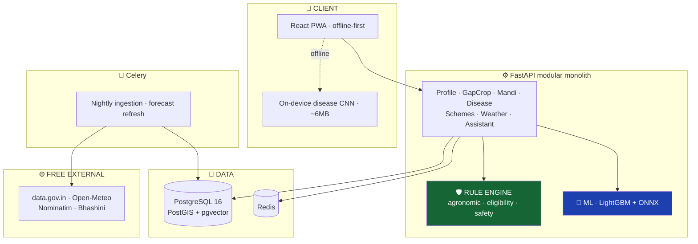

# 🌾 SmartKisan

**Farmer Decision Support Platform for Indian small & marginal farmers**

> ✅ **Project status: PHASE 1 COMPLETE — Gap Crop Recommendation Engine**
>
> Phase 1 is fully implemented: FastAPI backend endpoint `POST /api/v1/gap-crop/recommend`, SQLAlchemy models (`crop_catalog`, `regional_crop_calendar`, `crop_nutrient_profile`, `crop_compatibility`, `field_observations`), Alembic migration `0003_gap_crop_engine`, modular 5-factor scoring engine, data provenance tracking, frontend integration, and **175+ passing tests**.
>
> Documentation available at [`docs/phase-1-gap-crop.md`](docs/phase-1-gap-crop.md).

---

## The Problem

After a farmer in North India harvests wheat in April, they sow paddy in July.

**In between, the field sits empty for 60–90 days.**

Across the Indo-Gangetic plain that is millions of hectares of idle land, every single year. Most
farmers leave it fallow — not because nothing grows in summer, but because nobody tells them **what
to grow, whether it will actually pay, and where to sell it.**

SmartKisan answers exactly that, plus four related questions the same farmer asks during the year.

---

## What SmartKisan Does — 5 Decisions

| # | Decision | What the farmer asks |
|---|---|---|
| 1 | 🌱 **Gap crop** | *"My field is empty for 71 days. What should I plant to actually make money?"* |
| 2 | 🔍 **Disease** | *"My leaves have spots. What is it, and what do I spray?"* |
| 3 | 💰 **Selling** | *"Should I sell today or wait? Which mandi actually pays more?"* |
| 4 | 🏛️ **Schemes** | *"Which government schemes am I eligible for, and how do I apply?"* |
| 5 | 🎤 **Ask anything** | All of the above, by voice, in Hindi/Punjabi/Marathi/Bengali/Bhojpuri |

**Module 1 is the flagship.** Disease detection and price lookup exist in other apps. Turning an idle
71-day window into ₹40,000 does not.

---

## Three Design Rules That Define This Project

These are not aspirations — they are enforced in code and by build-blocking tests.

### 1️⃣ Rules decide what is *allowed*. ML decides what is *best*.

```
❌ WRONG:  model.predict() → "grow cucumber" → check if valid
✅ RIGHT:  filter_valid() → [moong, urad] → model ranks these two
```

A mis-ranked crop costs some profit. An **invalid** crop — cucumber on rainfed black-cotton soil —
costs the whole season. No score, weight, or model can resurrect a crop the agronomic rules excluded.
Enforced by property tests over thousands of random inputs.

### 2️⃣ The AI narrates. It never computes.

Every rupee, dosage, date, and eligibility verdict comes from deterministic code or a registered
model. The LLM only phrases it in the farmer's language.

A test suite extracts every number from every assistant response and matches it against the tool
results for that turn. **An unmatched number fails the build.**

### 3️⃣ Uncertainty is displayed, never hidden.

- Profit is shown as **₹38,400 – ₹54,500**, never a fake-precise ₹49,075
- Disease confidence is **calibrated** (ECE < 0.05) — "87%" actually means 87%
- Below the confidence threshold the app says *"I'm not sure — call your KVK"* and gives a phone number
- Photograph a goat instead of a leaf, and it refuses to diagnose

**Refusing to answer is a feature.** Farmers extend trust based on being right; one confident wrong
answer destroys it permanently.

---

## 📊 Honest Status

### ✅ Built and tested (Phase 0)

| Item | Detail |
|---|---|
| **FastAPI backend** | Modular monolith — auth, profile, health. OpenAPI at `/docs` |
| **PostgreSQL + PostGIS + pgvector** | Alembic migrations, GIST spatial index, DB-level data-quality constraints |
| **OTP auth** | JWT with refresh rotation + revocation; phone hashed and encrypted at rest |
| **State-aware land conversion** | 13 states × bigha/biswa/katha/kanal/guntha. **100% test coverage** |
| **Nominatim geocoding** | Cached, rate-limited, India bbox validated, confidence-classified |
| **Provenance envelope** | Every response names its source and age; `model_version` when a model was involved |
| **Degrade-never-fail** | Redis falls back to in-memory; health reports `degraded` rather than dying |
| **API client + TanStack Query** | Transparent token refresh, typed errors, staleness surfaced to the UI |
| **CI pipeline** | Lint, format, reversible-migration check, coverage gates, bundle budget, secret scan |
| **164 tests** | 147 backend (69 land conversion, 41 auth, 37 API) + 17 frontend |
| Complete SDLC design | 9 documents in [`docs/`](docs/) |

```bash
cd infra && docker compose up      # full stack
cd apps/api && pytest              # 147 passing
cd apps/web && npm test            # 17 passing
```

### ❌ Not built yet

| Item | Current reality | Lands in |
|---|---|---|
| Mandi price ingestion | 15 hardcoded rows, permanently dated `"Today"` | Phase 1 |
| Weather advisories | Static per-district text | Phase 1 |
| Gap crop engine | `crops.filter(c => c.duration <= gapDays + 10)` — soil, irrigation, and previous-crop inputs are **read but never used** | Phase 2 |
| Price forecast / yield models | `× 1.05` for "XGBoost". That is the entire model | Phase 3 |
| Disease detection | `setTimeout(2000)` then a pre-selected disease. The image is never read | Phase 4 |
| Scheme matching | `matchScore: 98` hardcoded | Phase 5 |
| Voice assistant | `if (query.includes('गेहूं'))` → canned string. 4 branches | Phase 5 |

**Every number the farmer-facing screens currently display is still fabricated.** Phases 1–6 replace
them one module at a time; each phase deletes its block of `mockData.js`.

---

## 🔌 Data Sources — All Free, All Verified

Tested live on **2026-08-04**:

| Source | Status | Evidence |
|---|---|---|
| **AGMARKNET** (data.gov.in) | ✅ **Working** | **16,942 price records for 2026-08-04**, updated same day 12:00 UTC |
| **Open-Meteo Forecast** | ✅ Working | 16-day forecast + hourly soil moisture, no API key |
| **Open-Meteo Archive** | ✅ Working | ERA5 reanalysis **back to 1940** — this is the ML training data |
| **Nominatim** | ✅ Working | `Karnal, Haryana → 29.7256, 76.9107` |
| **IMD** | ❌ Blocked | Registrations on hold pending a paid policy + IP whitelisting → we use Open-Meteo |
| **SoilGrids** | ⚠️ Degraded | Returns HTTP 200 with `null` values for all tested Indian coordinates |
| **Bhashini** | ⚠️ PoC only | Free tier is proof-of-concept; production needs a paid plan |

Live AGMARKNET response:
```json
{ "state": "Haryana", "district": "Yamuna Nagar", "market": "Radaur APMC",
  "commodity": "Tomato", "arrival_date": "04/08/2026",
  "min_price": 4000, "max_price": 5000, "modal_price": 4500 }
```

### The quirk that shapes the whole architecture

AGMARKNET's `arrival_date` is a **`DD/MM/YYYY` string, not a date.** No range queries are possible —
you can only request exact dates.

**So we cannot fetch price history. We must build our own.** A nightly job ingests ~17,000 records
into our database. After a year that is **~6 million rows** the public API will not give anyone.

That accumulated history is the training set for price forecasting — and the one asset no competitor
calling the API on demand will ever have.

---

## 🏗️ Target Architecture



**Deliberately a modular monolith, not microservices.** One developer, one deploy, SQL joins instead
of network calls. Boundaries are drawn so modules can be extracted later if there is ever a measured
need. Kubernetes for a solo project is a cost, not an achievement.

### Stack

| Layer | Technology |
|---|---|
| Frontend | React 18, Vite, PWA (Workbox), TanStack Query, i18next, onnxruntime-web |
| Backend | Python 3.11, FastAPI, SQLAlchemy 2, Alembic, Celery |
| Database | PostgreSQL 16 + PostGIS + pgvector, Redis |
| ML | LightGBM (price, yield), PyTorch/EfficientNet-B0 (disease), ONNX Runtime |
| MLOps | MLflow (registry + gates), DVC, Evidently (drift) |
| Infra | Docker Compose, Nginx, Prometheus + Grafana, Sentry, GitHub Actions |

---

## 🧠 The ML — What Is Genuinely Trainable

| Model | Approach | Real dataset | Honest expectation |
|---|---|---|---|
| **Gap crop** | Rules + weighted scoring + SHAP | ICAR norms + the models below | Expert-reviewed, not accuracy-scored |
| **Price forecast** | LightGBM quantile regression | Our own AGMARKNET history | 6–12% MAPE staples · 20–35% vegetables |
| **Yield** | LightGBM | District APY + ERA5 weather | R² 0.70–0.85 — **district-level prior, not farm-level** |
| **Disease** | EfficientNet-B0 → ONNX/TFLite | PlantVillage → **PlantDoc** | **~70% on real field photos** |
| **Schemes** | Rule engine + pgvector RAG | Official guidelines | 100% deterministic eligibility |
| **Voice** | Bhashini ASR → LLM tool-calling → TTS | — | Zero fabricated numbers |

### Three honesty notes

**On disease accuracy.** PlantVillage-trained models report 99%+ — on lab photos with clean
backgrounds. On real field images they collapse to 55–70%. **We report the PlantDoc (field) number as
the headline.** Any project claiming 99% is quoting the lab number and has not tested reality.

**On yield.** No public farm-level yield data exists in India. Our model predicts **district** yield,
then applies transparent, farmer-visible multipliers for irrigation and soil. The UI says so:
*"जिले का औसत: 21.4 → आपकी ट्यूबवेल के अनुसार: 23.1"*.

**On price forecasting.** A forecast that cannot beat "the price this week last year" is worthless.
Every model must beat a **seasonal-naive baseline** on walk-forward backtests. Commodities where it
loses show **no forecast at all** in the UI.

---

## 📚 Documentation

Read in order. Each builds on the last.

| Doc | Contents |
|---|---|
| [01 — SRS](docs/01-SRS.md) | Requirements (`FR-x.y`, `NFR-x`), personas, constraints, acceptance criteria |
| [02 — System Design](docs/02-SYSTEM-DESIGN.md) | Architecture, tech rationale, ADRs, security, observability |
| [03 — Data Design](docs/03-DATA-DESIGN.md) | Verified sources, full ERD, schema, quality rules, privacy |
| [04 — ML Design](docs/04-ML-DESIGN.md) | Every model: data, features, baselines, metrics, safety, MLOps |
| [05 — API Design](docs/05-API-DESIGN.md) | Endpoint contracts with real request/response examples |
| [06 — Workflows](docs/06-WORKFLOWS.md) | Step-by-step sequence diagrams for every user journey |
| [07 — UI/UX Design](docs/07-UI-UX-DESIGN.md) | Screens, design system, accessibility, migration plan |
| [08 — Project Plan](docs/08-PROJECT-PLAN.md) | 6 phases, 14 weeks, milestones, risk register |
| [09 — Testing Strategy](docs/09-TESTING-STRATEGY.md) | Test pyramid, property tests, anti-hallucination suite, CI gates |

**New here? Read [06 — Workflows](docs/06-WORKFLOWS.md) first.** The diagrams make the whole system
click faster than any prose.

---

## 🗓️ Roadmap

| Phase | Weeks | Delivers | Mock data deleted |
|---|---|---|---|
| **0 · Foundation** ✅ | 1–2 | FastAPI, Postgres+PostGIS, OTP auth, land conversion | — |
| **1 · Real Data** ⬅ next | 3–4 | AGMARKNET + Open-Meteo ingestion, net-realisation mandi ranking | prices, weather |
| **2 · Gap Crop** 🚩 | 5–6 | 20+ crops, hard constraints, Hindi explanations | crops |
| **3 · ML Models** | 7–8 | Price forecast + yield, backtested vs baseline | model metrics |
| **4 · Disease** | 9–10 | On-device CNN, OOD rejection, calibration, cited dosages | diseases |
| **5 · Schemes + Voice** | 11–12 | Rule engine + RAG, tool-calling assistant, 6 languages | schemes, voice |
| **6 · Production** | 13–14 | PWA offline, monitoring, field test with 10 farmers | **`mockData.js` deleted** |

**v1.0 ships when [all 10 acceptance criteria](docs/01-SRS.md#6-acceptance-criteria-v10-ships-when) are met** —
criterion #1 being **zero mock data**.

---

## 🚀 Running It

### Full stack (needs Docker)

```bash
cp apps/api/.env.example apps/api/.env
cd infra && docker compose up
```

Postgres+PostGIS, Redis, MinIO, and the API. Migrations run on boot.
API → http://localhost:8000 · docs → http://localhost:8000/docs

### Backend only (no Docker)

Redis is optional — the app falls back to an in-memory cache and reports
`degraded` on `/health/deep` rather than failing.

```bash
cd apps/api
python -m venv .venv && .venv/Scripts/activate   # or: source .venv/bin/activate
pip install -e ".[dev]"
cp .env.example .env                              # set DATABASE_URL
alembic upgrade head
uvicorn app.main:app --reload
```

### Frontend

```bash
cd apps/web
npm install
npm run dev      # http://localhost:5173, proxies /api to :8000
```

### Tests

```bash
cd apps/api && pytest                      # 147 — DB tests skip if Postgres is absent
cd apps/web && npm test                    # 17
```

### Try it

```bash
curl http://localhost:8000/health/deep

# In dev the OTP comes back in the response so the flow is testable
curl -X POST http://localhost:8000/api/v1/auth/otp/request \
     -H 'content-type: application/json' -d '{"phone":"9876543210"}'

# The same "5 bigha" is 1.25 acres in Haryana and 3.125 in UP
curl "http://localhost:8000/api/v1/reference/land-units?state=Haryana"
curl "http://localhost:8000/api/v1/reference/land-units?state=Uttar%20Pradesh"
```

---

## 🎯 What Makes This Different

Ranked by how much they matter to someone who knows the field:

1. **Tool-calling assistant that physically cannot fabricate numbers** — most projects let the LLM freestyle financial advice
2. **Offline-first PWA + quantised on-device CNN** — because the user has 2G and 200 MB/month
3. **Rules-over-ML safety layer** — hard agronomic and eligibility constraints that ML cannot override
4. **Calibrated uncertainty and a real "I don't know"** — with a KVK phone number attached
5. **Net-realisation mandi ranking** — a mandi paying ₹400/qtl more, 128 km away, is *worse*. Nobody computes this for the farmer.
6. **Backtested forecasting with a published baseline** — "MAPE 9.4% vs seasonal-naive 15.8%" beats any architecture diagram
7. **ML eval gates in CI** — a model cannot deploy unless it beats the incumbent on a frozen holdout

Deliberately **not** on that list: Kubernetes, microservices, Kafka. Those are answers to scale
problems this project does not have.

---

## ⚠️ Safety & Ethics

This app gives pesticide dosages and financial advice to people who may not read chemical labels.
That shapes the engineering:

- **Every chemical dosage is a curated, cited row** from ICAR / CIB&RC — enforced by a database
  `CHECK` constraint. An LLM is not in that code path at all.
- **Organic remedies are always listed first.**
- **Spray advice is weather-gated** — blocked when rain is forecast within 24 h or wind exceeds 15 km/h.
- **Every advisory carries a KVK disclaimer.**
- **Every recommendation is logged** with its inputs and model version, retained 3 years.
- **No full Aadhaar. No bank details.** EXIF GPS stripped from uploaded images.

> यह सलाह केवल मार्गदर्शन के लिए है। बड़े स्तर पर लागू करने से पहले अपने कृषि विज्ञान केंद्र (KVK) से पुष्टि करें।
> *Advisory only. Confirm with your KVK before large-scale application.*

---

## 📈 The Only Metric That Matters

Technical metrics are means, not ends. The one that decides whether this project mattered:

> **₹ earned by farmers on land that would otherwise have been fallow.**

Everything in [`docs/`](docs/) exists to move that number honestly.

---

## 📄 License

TBD

## 🙏 Data Attribution

- Mandi prices — [AGMARKNET](https://agmarknet.gov.in), Directorate of Marketing & Inspection, Ministry of Agriculture & Farmers Welfare, via [data.gov.in](https://data.gov.in) (NDSAP)
- Weather — [Open-Meteo](https://open-meteo.com) (ERA5 / ECMWF)
- Geocoding — [Nominatim](https://nominatim.openstreetmap.org) / OpenStreetMap contributors, ODbL
- Language models — [Bhashini](https://bhashini.gov.in) / AI4Bharat
- Agronomic references — ICAR Package of Practices; CIB&RC label claims
- Disease imagery — PlantVillage; PlantDoc

