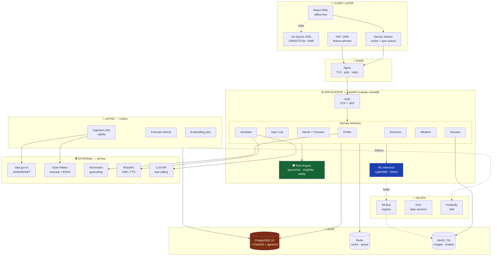
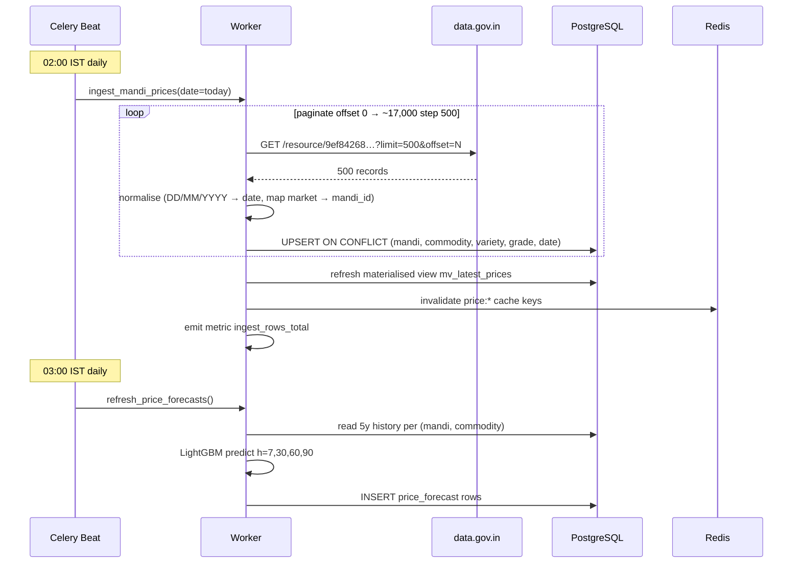
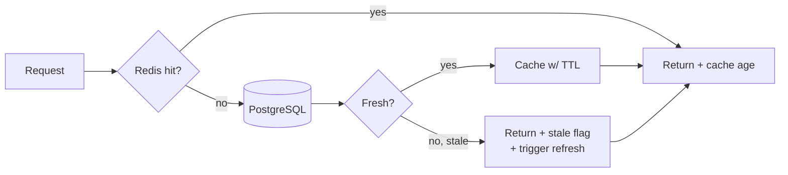
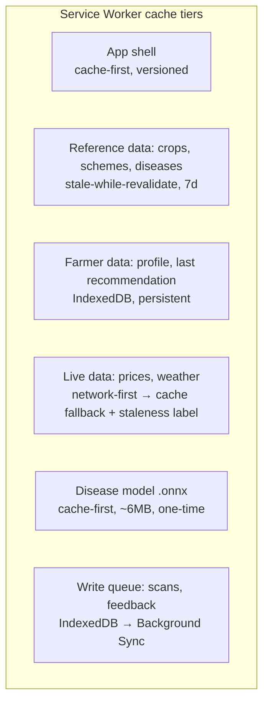
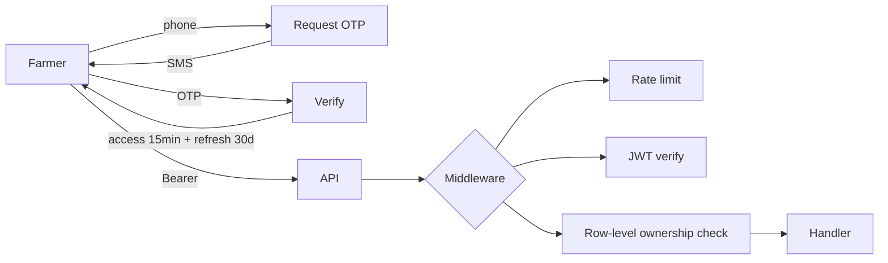
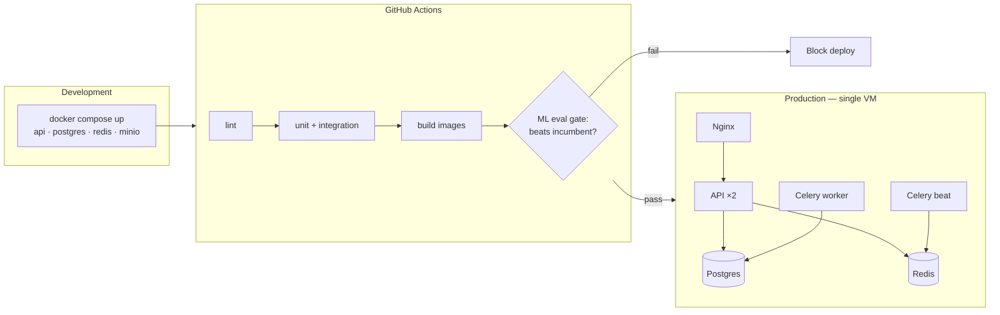

# 02 — System Design (High-Level Design)

**Project:** SmartKisan
**Version:** 2.0
**Traces to:** [01-SRS.md](01-SRS.md)

---

## 1. Design Principles

These five rules govern every decision in this document. When in doubt, return here.

### P1 — Rules bound ML, never the reverse

ML **ranks**. Rules **permit**. A model may reorder a list of already-valid options; it may never
introduce an option that violates an agronomic, legal, or safety constraint.

```
❌ WRONG:  model.predict() → "grow cucumber"  → check if valid
✅ RIGHT:  filter_valid_crops() → [moong, urad] → model ranks these two
```

*Why:* a mis-ranked recommendation costs a farmer some profit. An **invalid** recommendation
(cucumber on rainfed black cotton soil) costs them the entire season.

### P2 — The LLM narrates; it never computes

Every rupee, date, dosage, and eligibility verdict is produced by deterministic code or a
registered model, then handed to the LLM to *phrase*. The LLM has no authority to originate a fact.

*Why:* a hallucinated ₹49,000 profit figure that a farmer acts on is the worst possible failure mode.

### P3 — Uncertainty is displayed, not hidden

Ranges over point estimates. Calibrated confidence over raw softmax. "I don't know" over a guess.

*Why:* farmers extend trust based on being right. One confident wrong answer destroys years of it.

### P4 — Degrade, never fail

Network down → cached data with a staleness label. Model unsure → route to KVK. External API 500 →
last-known-good. **A blank screen is a bug.**

### P5 — Every output is logged and reproducible

Recommendation ID, inputs, model version, timestamp. Three-year retention. This is both an audit
trail and the training data for v2.

---

## 2. Architecture Overview



---

## 3. Why a Modular Monolith (not microservices)

| Factor | Microservices | **Modular Monolith ✅** |
|---|---|---|
| Team size | Needs 1 team per service | **One developer** |
| Deploy complexity | K8s, service mesh, distributed tracing | One Docker Compose |
| Local dev | Run 7 services to test one flow | `docker compose up` |
| Cross-module query | Network call + eventual consistency | SQL join |
| Debugging | Distributed traces | One stack trace |
| Cost | 7 containers minimum | 3 containers |

**Decision:** modular monolith with **strict internal boundaries**. Each module owns its tables and
exposes a service interface. If a module later needs independent scaling, the boundary is already
drawn and extraction is mechanical.

> Choosing microservices here would be resume-driven design. Reviewers who know the field
> recognise the difference — and the *stated reasoning* above is worth more than the diagram.

**Enforced boundary rule:** a module may call another module's **service class**, never its
tables or ORM models directly. Verified by an import-linter rule in CI.

---

## 4. Technology Stack & Rationale

### 4.1 Backend

| Choice | Why | Rejected alternative |
|---|---|---|
| **Python 3.11 + FastAPI** | ML ecosystem lives in Python; one language for API + models. Async, auto OpenAPI, Pydantic validation | Node/Express — would force a second service for ML |
| **PostgreSQL 16** | ACID, JSONB, window functions for time-series, mature | MongoDB — agri data is deeply relational |
| **PostGIS** | "Mandis within 50 km" is a native spatial query, not app-layer haversine | Manual distance math — slow and un-indexable |
| **pgvector** | Scheme-document RAG without a second datastore | Pinecone/Qdrant — another service, another cost |
| **Redis** | Cache + Celery broker in one | Memcached — no queue |
| **Celery + beat** | Scheduled ingestion, retries, monitoring | Cron — no retry, no visibility |
| **SQLAlchemy 2 + Alembic** | Typed ORM, versioned migrations | Raw SQL — unmaintainable schema evolution |

### 4.2 ML

| Choice | Why |
|---|---|
| **LightGBM** (price, yield) | Best-in-class on tabular data; fast training on a laptop; native categorical support; SHAP for explanations |
| **PyTorch + timm** (disease) | Pretrained EfficientNet/MobileNet; clean export path |
| **ONNX Runtime** | One model artefact runs on server *and* in-browser |
| **MLflow** | Experiment tracking + model registry + promotion gates |
| **DVC** | Version datasets without committing GBs to git |
| **Evidently** | Drift detection with minimal setup |

### 4.3 Frontend

| Choice | Why |
|---|---|
| **React 18 + Vite** | Already your stack — preserve existing work |
| **PWA + Workbox** | Offline is a hard requirement (NFR/FR-8.2), not a nicety |
| **TanStack Query** | Cache, retry, stale-while-revalidate — exactly the degrade-never-fail behaviour of P4 |
| **i18next** | Standard i18n with plural/gender rules for Indic languages |
| **Recharts** | Lightweight charts; price history is core UX |
| **onnxruntime-web** | On-device disease inference, no upload, works offline |

### 4.4 Infrastructure

| Choice | Why |
|---|---|
| **Docker Compose** | Whole stack up in one command; identical dev/prod |
| **GitHub Actions** | Free CI; lint → test → train → **eval gate** → deploy |
| **Prometheus + Grafana** | Standard metrics; free |
| **Sentry** | Error tracking; generous free tier |

---

## 5. Module Design

Every domain module follows the same internal shape:

```
apps/api/modules/<name>/
├── router.py       # HTTP layer — validation, auth, serialization. No logic.
├── service.py      # Business logic. The only place decisions are made.
├── rules.py        # Deterministic constraints (where applicable)
├── repository.py   # Data access. The only place SQL lives.
├── schemas.py      # Pydantic request/response contracts
└── models.py       # SQLAlchemy tables (owned by this module)
```

**Dependency direction:** `router → service → {rules, repository, ml}`. Never upward, never sideways
into another module's repository.

### 5.1 The Rule Engine (`shared/rules/`)

The safety layer. Three independent rule sets:

```python
# 1. AGRONOMIC — can this crop physically grow here?
class AgronomicRules:
    def filter_viable(self, crops, plot, gap_days, district_climate) -> list[Crop]:
        """HARD filter. Returns only crops that pass ALL constraints.
        Each exclusion is recorded with a reason for transparency (FR-2.8)."""

# 2. ELIGIBILITY — does this farmer qualify for this scheme?
class SchemeEligibilityRules:
    def evaluate(self, farmer, scheme) -> EligibilityResult:
        """Deterministic. Returns eligible/not + which rules passed/failed.
        The LLM is given this result; it never produces one. (FR-5.2)"""

# 3. SAFETY — is it safe to give this advice today?
class SafetyRules:
    def check_spray_advice(self, recommendation, weather) -> SafetyVerdict:
        """Blocks pesticide advice when rain <24h or wind >15 km/h. (FR-4.10)"""
```

Rules are **pure functions** — no I/O, no randomness. This makes them exhaustively unit-testable,
which is why NFR-7.1 demands ≥90% coverage here.

### 5.2 ML Inference Service (`shared/ml/`)

```python
class ModelRegistry:
    """Loads models from MLflow at startup, holds them in memory.
    Every prediction returns (value, confidence, model_version) — never a bare number."""

    def predict_price(self, commodity, mandi_id, horizon) -> PriceForecast
    def predict_yield(self, crop, district, plot) -> YieldEstimate    # returns a RANGE
    def classify_disease(self, image) -> DiseaseResult | OODRejection
    def embed(self, text) -> vector
```

Models load once at startup. If a model fails to load, the app **starts anyway** with that feature
disabled and a health-check warning — degrade, never fail (P4).

---

## 6. Data Flow

### 6.1 Nightly ingestion (Celery beat)



**Failure handling:** each page retries 3× with exponential backoff. If the whole job fails,
`mv_latest_prices` retains yesterday's data and the API serves it with `stale: true` and the
last-updated timestamp (P4, FR-3.9).

### 6.2 Read path with cache



| Data | TTL | Rationale |
|---|---|---|
| Mandi prices (today) | 6 h | Source updates once daily |
| Price history | 24 h | Immutable once written |
| Price forecast | 24 h | Regenerated nightly |
| Weather forecast | 3 h | Open-Meteo refresh cadence |
| Scheme list | 7 d | Rarely changes |
| Crop database | 24 h | Rarely changes |
| Gap-crop recommendation | 1 h | Depends on live price + weather |

---

## 7. Offline Strategy (FR-8.2)



**What works with zero network:**
- Open the app, view profile, view last gap-crop recommendation
- Scan a leaf for disease (on-device model) and get organic/chemical advice
- Browse crop database, scheme list, disease library
- View last-fetched prices and weather **clearly labelled with their age**

**What requires network:** fresh prices, fresh forecasts, voice assistant, scheme RAG follow-ups.

Offline actions are queued in IndexedDB and flushed via Background Sync on reconnect.

---

## 8. Security Design



| Layer | Control |
|---|---|
| Transport | TLS 1.2+, HSTS, secure cookies |
| Auth | OTP → JWT; refresh-token rotation; revocation list in Redis |
| Authorisation | Every farm/plot query filtered by `farmer_id` from the token — never from the request body |
| Input | Pydantic validation; image magic-byte check + size cap; EXIF GPS stripped |
| Rate limit | 60/min general · 10/min OTP · 10/min upload |
| Secrets | Env vars / secret manager; `.env` git-ignored; CI secret scanning |
| PII | Phone encrypted at rest, hashed in analytics; **no full Aadhaar, no bank details** |
| Audit | Append-only log of every recommendation, advisory, and admin action |

---

## 9. Observability

| Signal | Tool | Key items |
|---|---|---|
| Metrics | Prometheus + Grafana | Request rate/latency/errors, ingestion rows, cache hit ratio, model inference latency, OOD rejection rate |
| Logs | structlog → JSON | Correlation ID per request; model version on every prediction |
| Errors | Sentry | Grouped, with release tagging |
| ML drift | Evidently (weekly) | Feature drift, prediction drift, forecast MAPE vs realised |
| Health | `/health` + `/health/deep` | DB, Redis, model-load status, last-ingestion age |

**Business metrics that actually matter** (tracked separately in Grafana):

- Recommendations served → % where farmer recorded what they actually planted
- Forecast MAPE vs realised price at horizon
- Disease scans → % OOD-rejected → % routed to KVK
- Schemes shown → applications reported started

---

## 10. Deployment



**v1 target:** one 4 vCPU / 8 GB VM running everything. This comfortably serves NFR-2.1
(100k registered / 10k DAU). Kubernetes is deliberately deferred until there is a measured need.

---

## 11. Key Architecture Decisions (ADR summary)

| # | Decision | Rationale | Trade-off accepted |
|---|---|---|---|
| ADR-1 | Modular monolith | One developer, one deploy, joins over network calls | Must scale vertically first |
| ADR-2 | Python everywhere | ML and API share language and models | Slower than Go for pure I/O |
| ADR-3 | Rules gate ML | Safety and defensibility (P1) | Less "pure AI" narrative |
| ADR-4 | LLM tool-calling only | Cannot hallucinate facts (P2) | More engineering than free-form chat |
| ADR-5 | Build our own price history | AGMARKNET has no range query (C-4) | Cold start — need backfill or wait |
| ADR-6 | Open-Meteo over IMD | IMD registration closed + paid policy | Not "official Indian" data |
| ADR-7 | pgvector over dedicated vector DB | One less service; scheme corpus is small (~thousands of chunks) | Would not scale to millions |
| ADR-8 | On-device disease model | Offline, private, free inference | Model size/accuracy ceiling |
| ADR-9 | District-level yield prior | No public farm-level yield data (C-3) | Must state this limitation in the UI |
| ADR-10 | PWA over native app | One codebase, no Play Store friction, instant updates | No deep OS integration |

---

## 12. Repository Layout

```
smartkisan/
├── docs/                       ← you are here
├── apps/
│   ├── web/                    React PWA (existing src/ moves here)
│   │   ├── src/features/       one folder per module
│   │   ├── src/shared/         ui, hooks, api client, i18n
│   │   ├── src/lib/onnx/       on-device inference
│   │   └── public/locales/     hi, pa, mr, bn, bho, en
│   └── api/                    FastAPI
│       ├── modules/            profile, gapcrop, mandi, disease, schemes, weather, assistant
│       ├── shared/             rules/, ml/, db/, cache/, external/
│       ├── workers/            celery tasks + beat schedule
│       └── migrations/         alembic
├── ml/
│   ├── ingestion/              agmarknet, openmeteo, shc, apy loaders
│   ├── training/               price_forecast/, yield/, disease/
│   ├── evaluation/             baselines, backtests, calibration
│   └── export/                 onnx / tflite conversion
├── infra/
│   ├── docker-compose.yml
│   ├── nginx/
│   └── grafana/
└── .github/workflows/
```

---

**Next:** [03-DATA-DESIGN.md](03-DATA-DESIGN.md) — entity model, schema, and data sources.
