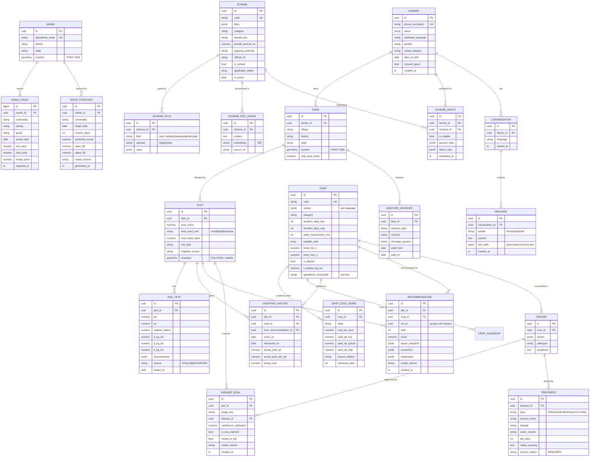
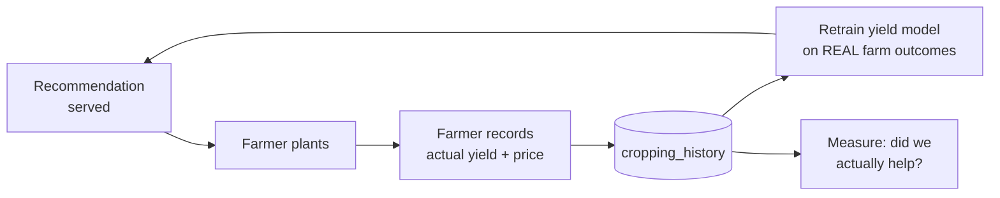

# 03 — Data Design

**Project:** SmartKisan
**Version:** 2.0
**Traces to:** [01-SRS.md](01-SRS.md) · [02-SYSTEM-DESIGN.md](02-SYSTEM-DESIGN.md)

---

## 1. Data Sources — Verified Status

All sources tested live on **2026-08-04**. Every source is free.

### 1.1 ✅ Working — verified by live call

| Source | What | Endpoint | Auth | Verified result |
|---|---|---|---|---|
| **AGMARKNET** via data.gov.in | Daily mandi prices, all-India | `api.data.gov.in/resource/9ef84268-d588-465a-a308-a864a43d0070` | Free API key | **16,942 records for 2026-08-04**; `updated_date 12:00 UTC same day` |
| **Open-Meteo Forecast** | 16-day weather + soil moisture | `api.open-meteo.com/v1/forecast` | None | Hourly `soil_moisture_0_to_1cm` returned |
| **Open-Meteo Archive** | ERA5 reanalysis, **1940 → present** | `archive-api.open-meteo.com/v1/archive` | None | 2024-04-01→05 daily tmax/precip returned |
| **Nominatim** | Village/district → lat/long | `nominatim.openstreetmap.org/search` | None (User-Agent required) | `Karnal, Haryana → 29.7256, 76.9107` |

**Live AGMARKNET record shape:**
```json
{
  "state": "Haryana", "district": "Yamuna Nagar", "market": "Radaur APMC",
  "commodity": "Tomato", "variety": "Other", "grade": "Medium",
  "arrival_date": "04/08/2026",
  "min_price": 4000, "max_price": 5000, "modal_price": 4500
}
```

### 1.2 ⚠️ Blocked or limited

| Source | Status | Our mitigation |
|---|---|---|
| **IMD** (`api.imd.gov.in`) | New registrations **on hold** pending a paid usage policy; also needs IP whitelisting + nodal-officer approval | **Use Open-Meteo** (ADR-6). Same data class, zero friction |
| **SoilGrids** (ISRIC) | Returns HTTP 200 but `"mean": null` for all tested Indian coordinates and depths | Use **SHC bulk dataset** + farmer-declared soil type |
| **Bhashini** | Free tier is **PoC-only**; production/commercial use requires a paid plan | Pilot on free tier; plan self-hosted AI4Bharat models |
| **Soil Health Card portal** | No live API; data.gov.in resources are static aggregates, several show "Request API" | Load **AIKosh SHC bulk CSV** into Postgres once |

### 1.3 📦 Bulk datasets (download once, load into Postgres)

| Dataset | Use | Notes |
|---|---|---|
| **AIKosh SHC dataset** | Soil nutrient priors by district | ~5 crore samples, 12 parameters |
| **District APY** (data.gov.in / DES / India Data Portal CKAN) | Yield model training | District × crop × season × year: area, production, yield |
| **PlantVillage** | Disease CNN pretraining | 54k images, 38 classes — **lab conditions, clean backgrounds** |
| **PlantDoc** | Disease CNN fine-tuning + **honest eval** | ~2.6k real in-field images |
| **MSP announcements** | Price floor comparison (FR-3.4) | Published annually by CACP |
| **ICAR package of practices** | Cited dosages (FR-4.9) | Manual curation — the citation is the point |

---

## 2. The `arrival_date` Problem — and why it shapes the architecture

AGMARKNET's `arrival_date` is a **string in `DD/MM/YYYY`**, not a date type.

**Consequence:** you cannot query a range. No `BETWEEN`, no `>=`. You can only request exact dates
and paginate.

**Therefore:**

1. We **cannot** ask the API for price history. We must **build our own.**
2. A nightly Celery job pulls today's ~17,000 records and appends to our `mandi_price` table.
3. After 12 months we own **~6 million rows** of price history that the public API will not give us.

This is not a workaround — it is the moat. That accumulated history is the training set for the
price-forecasting model (M2), and no competitor who calls the API on-demand has it.

**Cold start:** for launch we backfill by iterating dates backwards, one call per date, rate-limited.
~365 calls per year of history. Plus historical CSVs from data.gov.in where available.

---

## 3. Entity Relationship Diagram



---

## 4. Critical Schema Details

### 4.1 Mandi price — the ingestion table

```sql
CREATE TABLE mandi_price (
    id              BIGSERIAL PRIMARY KEY,
    mandi_id        UUID NOT NULL REFERENCES mandi(id),
    commodity       TEXT NOT NULL,
    variety         TEXT NOT NULL DEFAULT 'Other',
    grade           TEXT NOT NULL DEFAULT 'FAQ',
    arrival_date    DATE NOT NULL,              -- parsed from DD/MM/YYYY on ingest
    min_price       NUMERIC(10,2),
    max_price       NUMERIC(10,2),
    modal_price     NUMERIC(10,2) NOT NULL,
    ingested_at     TIMESTAMPTZ NOT NULL DEFAULT now(),

    -- Idempotent re-ingestion. Re-running the job never duplicates.
    CONSTRAINT uq_price UNIQUE (mandi_id, commodity, variety, grade, arrival_date)
);

CREATE INDEX ix_price_lookup  ON mandi_price (commodity, arrival_date DESC);
CREATE INDEX ix_price_series  ON mandi_price (mandi_id, commodity, arrival_date);

-- Partition by year once the table passes ~5M rows
```

**Upsert pattern used by the nightly job:**
```sql
INSERT INTO mandi_price (...) VALUES (...)
ON CONFLICT (mandi_id, commodity, variety, grade, arrival_date)
DO UPDATE SET modal_price = EXCLUDED.modal_price,
              min_price   = EXCLUDED.min_price,
              max_price   = EXCLUDED.max_price,
              ingested_at = now();
```

**Materialised view for the hot read path:**
```sql
CREATE MATERIALIZED VIEW mv_latest_price AS
SELECT DISTINCT ON (mandi_id, commodity)
       mandi_id, commodity, variety, grade, arrival_date,
       min_price, max_price, modal_price
FROM mandi_price
ORDER BY mandi_id, commodity, arrival_date DESC;

CREATE UNIQUE INDEX ON mv_latest_price (mandi_id, commodity);
-- REFRESH CONCURRENTLY at the end of each nightly ingest
```

### 4.2 Land unit conversion (FR-1.5) — state-aware

We store **both** what the farmer typed and the canonical value:

```sql
area_input_unit   TEXT,          -- 'bigha'
area_input_value  NUMERIC(10,3), -- 5.0
area_acres        NUMERIC(10,4)  -- 3.125  ← everything downstream uses this
```

| Unit | State | Acres |
|---|---|---|
| bigha | Uttar Pradesh | 0.625 |
| bigha | Bihar | 0.6172 |
| bigha | Punjab / Haryana | 0.25 |
| bigha | Rajasthan (pucca) | 0.625 |
| bigha | West Bengal | 0.3306 |
| biswa | UP (1/20 bigha) | 0.03125 |
| kanal | Punjab / J&K | 0.125 |
| guntha | Maharashtra / Karnataka | 0.025 |
| hectare | all | 2.4711 |

> ⚠️ **A wrong bigha conversion silently corrupts every rupee figure in the app.**
> This table lives in the database with a `source` column, is unit-tested exhaustively,
> and the UI always echoes back "5 बीघा = 3.13 एकड़" for the farmer to confirm.

### 4.3 Yield stored as a range, never a point (FR-2.6)

```sql
yield_qtl_low       NUMERIC(8,2),   -- 10th percentile
yield_qtl_typical   NUMERIC(8,2),   -- median
yield_qtl_high      NUMERIC(8,2),   -- 90th percentile
source_citation     TEXT NOT NULL   -- 'ICAR Package of Practices, Zaid Pulses 2023, p.14'
```

The UI shows **"₹38,000 – ₹52,000 (typical ₹45,000)"**, never a bare "₹49,075".

### 4.4 Treatment citations are mandatory (FR-4.9)

```sql
ALTER TABLE treatment
  ADD CONSTRAINT chk_citation_required
  CHECK (source_citation IS NOT NULL AND length(trim(source_citation)) > 10);
```

A chemical dosage without a citation **cannot physically be inserted**. The database enforces the
safety requirement, not a code review.

### 4.5 Spatial queries (PostGIS)

```sql
-- Mandis within 50 km, nearest first — index-backed, not app-layer haversine
SELECT m.*, ST_Distance(m.location::geography, f.location::geography)/1000 AS km
FROM mandi m, farm f
WHERE f.id = :farm_id
  AND ST_DWithin(m.location::geography, f.location::geography, 50000)
ORDER BY km;

CREATE INDEX ix_mandi_geo ON mandi USING GIST (location);
CREATE INDEX ix_farm_geo  ON farm  USING GIST (location);
```

### 4.6 Vector search for scheme RAG (pgvector)

```sql
CREATE EXTENSION IF NOT EXISTS vector;

ALTER TABLE scheme_doc_chunk ADD COLUMN embedding vector(768);
CREATE INDEX ix_chunk_vec ON scheme_doc_chunk
  USING hnsw (embedding vector_cosine_ops);

-- Retrieval is ALWAYS scoped to schemes the rule engine already approved.
-- The vector search explains; it never determines eligibility. (FR-5.2)
SELECT content, source_url
FROM scheme_doc_chunk
WHERE scheme_id = ANY(:rule_engine_approved_ids)
ORDER BY embedding <=> :query_embedding
LIMIT 5;
```

---

## 5. The Feedback Loop — why `cropping_history` is the most valuable table



Public data gives district averages. **`cropping_history` gives farm-level truth** — the thing no
public dataset contains and no competitor can copy.

`from_recommendation_id` links outcome back to the exact advice given, so we can compute:

- **Adoption rate** — % of recommendations actually planted
- **Accuracy** — predicted vs. actual yield and profit
- **Real impact** — ₹ earned on land that was previously fallow

That last number is the only metric that matters.

---

## 6. Data Quality Rules

Enforced at ingestion — bad data never enters the tables:

| Check | Rule | Action on failure |
|---|---|---|
| Price sanity | `0 < min ≤ modal ≤ max` | Reject row, log |
| Price outlier | modal within 5× rolling 90-day median | Quarantine for review |
| Date sanity | `arrival_date` ≤ today, ≥ 2010 | Reject |
| Mandi mapping | AGMARKNET market name resolves to a known `mandi_id` | Auto-create with `needs_geocoding` flag |
| Commodity mapping | maps to a known `crop.agmarknet_commodity` | Store raw; flag for curation |
| Coordinates | within India bbox (6–38 N, 68–98 E) | Reject |
| Soil test | pH 3–10, OC 0–5%, N/P/K ≥ 0 | Reject |

**Commodity name normalisation** is a real ongoing task — AGMARKNET has `"Bottle gourd"`,
`"Bottle Gourd"`, `"Lauki"` for the same vegetable. A curated alias table maps raw strings to
`crop.id`; unmapped names are logged for weekly review.

---

## 7. Retention & Privacy (NFR-4.6, DPDP Act 2023)

| Data | Retention | Notes |
|---|---|---|
| Farmer profile | Until deletion requested | Right to erasure honoured within 30 days |
| Recommendations / advisories | 3 years | Audit requirement (FR-8.6) |
| Mandi prices | Indefinite | Public data, no PII |
| Disease scan images | 90 days, then delete original | Anonymised copy retained for retraining **only with consent** |
| Conversation logs | 1 year | Consent-gated (FR-7.8) |
| Auth / access logs | 1 year | Security |

**On deletion request:** PII is hard-deleted; recommendations are anonymised (`farmer_id → NULL`,
`plot_id` retained) so aggregate model training and audit history survive without identifying anyone.

---

## 8. Storage Estimate (100k farmers, year 1)

| Table | Rows | Size |
|---|---|---|
| `mandi_price` | ~6.2 M (17k/day × 365) | ~1.2 GB |
| `price_forecast` | ~2 M | ~400 MB |
| `weather_daily` | ~1.5 M | ~250 MB |
| `farmer` / `farm` / `plot` | ~350 k | ~80 MB |
| `recommendation` | ~2 M | ~600 MB |
| `disease_scan` (metadata) | ~500 k | ~100 MB |
| Images (S3, 90-day window) | ~150 k @ 200 KB | ~30 GB |
| **Postgres total** | | **~3 GB** |

Comfortably within a single instance. Partition `mandi_price` by year when it passes 5M rows.

---

**Next:** [04-ML-DESIGN.md](04-ML-DESIGN.md) — model specifications and training plan.
