# 06 — Workflows

**Project:** SmartKisan
**Version:** 2.0
**Traces to:** [01-SRS.md](01-SRS.md) · [05-API-DESIGN.md](05-API-DESIGN.md)

This document shows **what actually happens**, step by step, for each user journey. Read this to
understand how the pieces connect.

---

## 0. The Master Journey — Ramesh's year

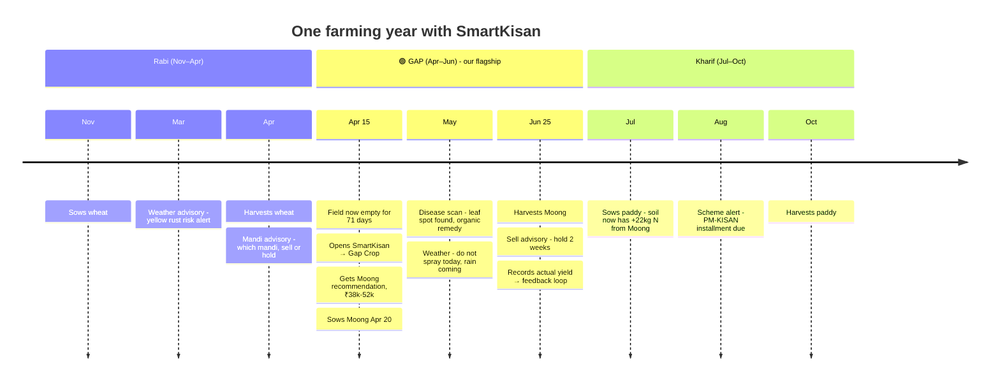

**The point:** the gap module turns 71 idle days into ~₹46,000 *and* improves the next paddy crop.
Everything else supports that core loop.

---

## 1. Onboarding — FR-1

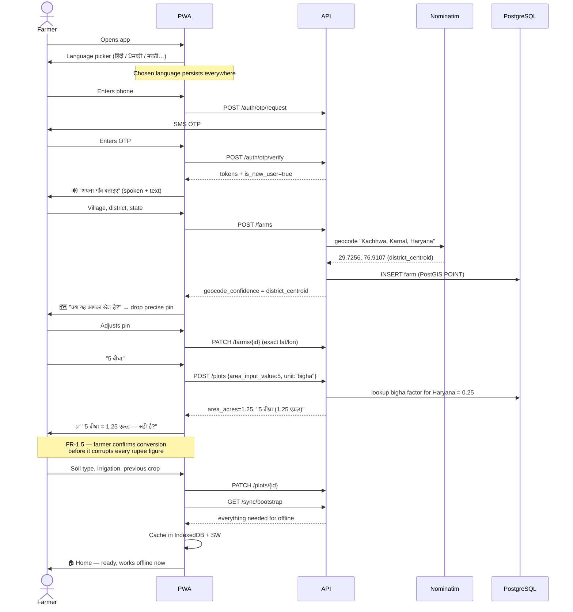

**Design notes:**
- Language **first** — before any text the farmer must read
- Every prompt is spoken as well as written (NFR-5.4)
- Geocode confidence drives a pin-correction prompt — district-centroid weather ≠ field weather
- Unit conversion is echoed and confirmed (the single highest-risk data entry point)
- `bootstrap` at the end means the app is offline-capable from minute one

---

## 2. Gap Crop Recommendation — FR-2 *(flagship flow)*

```mermaid
sequenceDiagram
    actor F as Farmer
    participant A as PWA
    participant API as API
    participant R as 🛡️ Rule Engine
    participant M3 as M3 Yield
    participant M2 as M2 Price
    participant DB as DB
    participant WX as Open-Meteo

    F->>A: Taps "खाली खेत" (Empty Field)
    A->>F: "कब से कब तक खाली है?" (slider, default from previous_harvest_date)
    F->>A: Apr 15 → Jun 25 (71 days)
    A->>API: POST /recommendations/gap-crop

    API->>DB: load plot, soil_test, previous_crop
    API->>WX: district climate normals + season forecast
    API->>DB: SELECT * FROM crop (all ~20 Zaid crops)

    rect rgb(22, 101, 52)
    Note over R: STAGE 1 — HARD FILTER (no ML)
    API->>R: filter_viable(crops, plot, 71 days, climate)
    R->>R: duration ≤ 64 (71−7 safety)?
    R->>R: soil compatible?
    R->>R: water available for irrigation type?
    R->>R: temperature tolerance for district?
    R->>R: disease carryover from previous crop?
    R-->>API: viable=[moong, urad, maize, dhaincha, okra…]<br/>excluded=[(cotton,"duration"), (cucumber,"soil")…]
    end

    rect rgb(30, 64, 175)
    Note over M3,M2: STAGE 2 — ML on VIABLE ONLY
    loop each viable crop
        API->>M3: predict_yield(crop, district, plot)
        M3-->>API: {low:6.9, typical:8.1, high:9.4} qtl/acre
        API->>M2: forecast(commodity, nearest_mandi, h=crop.duration)
        M2-->>API: {pred:8420, lo80:8050, hi80:8790, beats_baseline:true}
        API->>DB: cost norm for (crop, state)
        API->>API: net_profit RANGE = yield×price − cost
        API->>API: score = w·profit − w·risk + w·rotation + w·soil…
    end
    end

    API->>API: rank by score; SHAP → explanation terms
    API->>DB: INSERT recommendation rows (run_id, model_versions) [FR-2.11 audit]
    API-->>A: ranked list + economics ranges + excluded list

    A->>F: 🥇 मूंग — ₹38,000–52,000<br/>✓ 65 दिन ✓ मिट्टी उपयुक्त ✓ नाइट्रोजन<br/>⚠ जून बारिश जोखिम
    A->>F: 🔊 speaks the whole card
    F->>A: "क्यों कपास नहीं?" → taps excluded
    A->>F: "कपास को 160 दिन चाहिए, आपके पास 71 हैं"
    A->>A: Cache recommendation → available offline
```

### The critical ordering

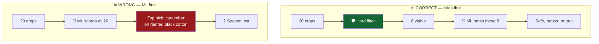

**Cost of getting this wrong:** a mis-ranked crop loses some profit. An **invalid** crop loses the
whole season, the seed money, and the farmer's trust permanently.

### Feedback loop — FR-2.12

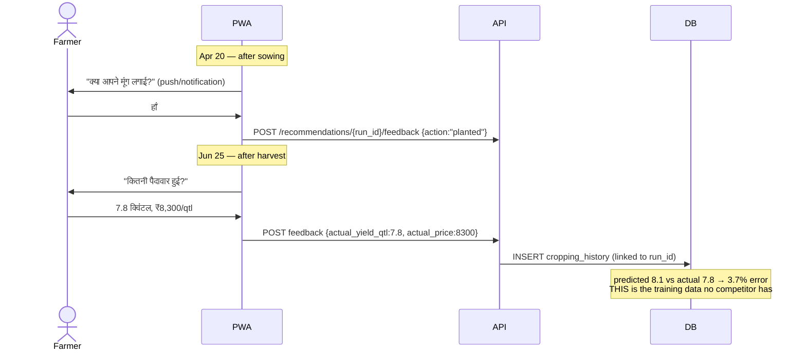

---

## 3. Mandi Price & Sell Decision — FR-3

### 3.1 Nightly ingestion (the foundation)

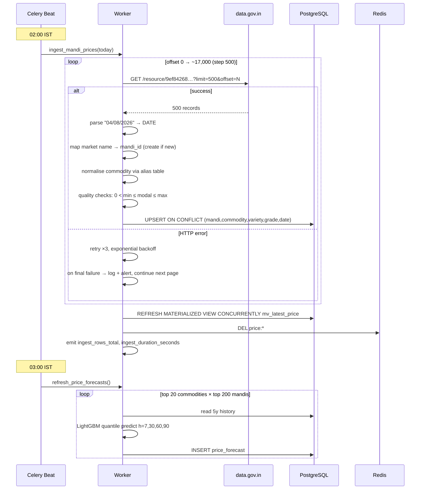

**Why this shape:** AGMARKNET's `arrival_date` is a `DD/MM/YYYY` **string** — no range queries
possible (C-4). We must accumulate our own history, one day at a time. After a year that's ~6M rows
and the training set for M2.

**If the job fails entirely:** `mv_latest_price` still holds yesterday's data. The API serves it with
`is_stale: true` and the real `data_as_of` timestamp. The farmer sees "कल का भाव" — never a blank
screen (P4).

### 3.2 Sell decision — where to sell

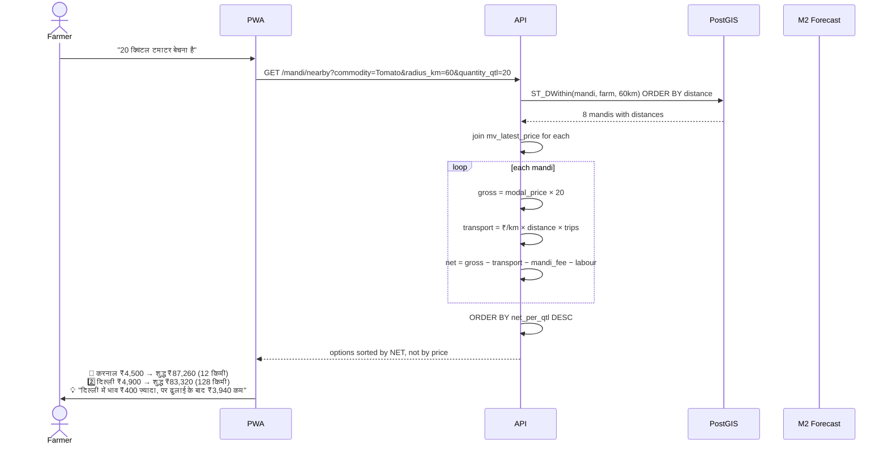

> **This is the whole product in one screen.** AGMARKNET's website shows ₹4,900 for Delhi and lets
> the farmer drive 128 km to lose ₹3,940. Sorting by **net realisation** instead of headline price
> is FR-3.7, and nobody else does it.

### 3.3 Sell or hold?

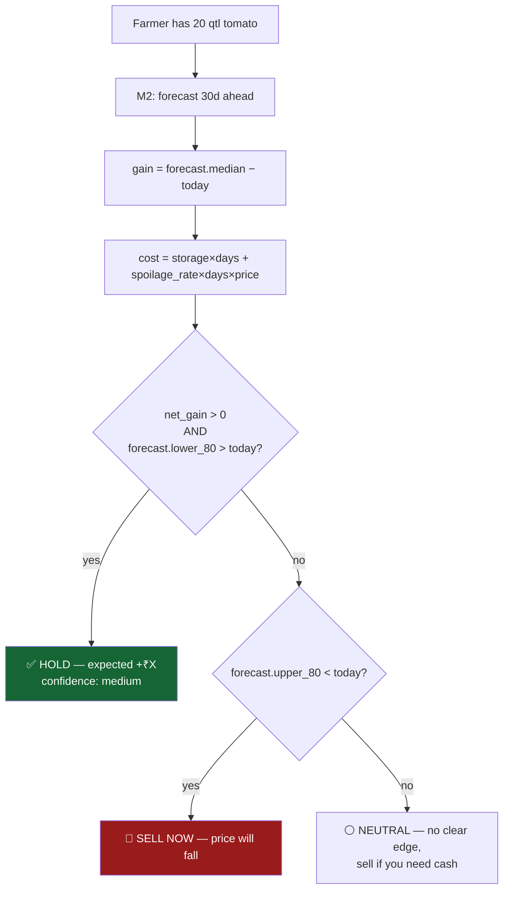

**Both conditions are required for HOLD.** A positive median with a CI that straddles today's price
is not actionable advice — it's a coin flip dressed as insight. And tomatoes spoil: `spoilage_rate`
is per-commodity, which is why "hold, price will rise" is dangerous for vegetables and reasonable
for wheat.

---

## 4. Disease Detection — FR-4

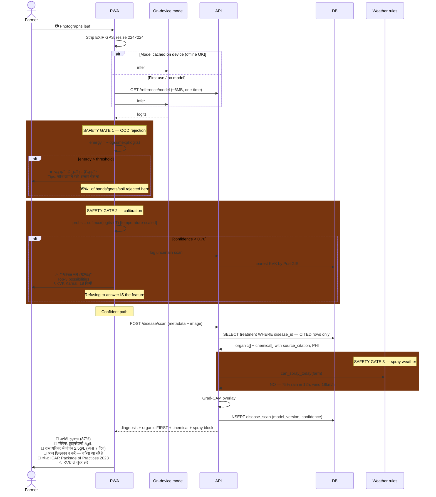

### Three gates, three failure modes prevented

| Gate | Prevents | Method | Target |
|---|---|---|---|
| **OOD rejection** | Confidently diagnosing a photo of a goat | Energy score | ≥95% non-leaf rejected |
| **Calibration + abstention** | "87%" meaning nothing; wrong diagnosis acted on | Temperature scaling, threshold 0.70 | ECE < 0.05 |
| **Weather gate** | Farmer wastes money spraying before rain | Rule check on forecast | Blocks when rain <24h or wind >15 km/h |

**Treatment text is never generated.** It is a SQL lookup into a table where `source_citation` is a
NOT NULL CHECK-constrained column. An LLM cannot invent a dosage because an LLM is not in this path.

---

## 5. Scheme Matching — FR-5

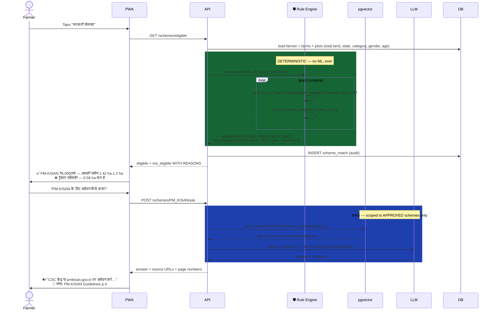

### Why eligibility is never ML

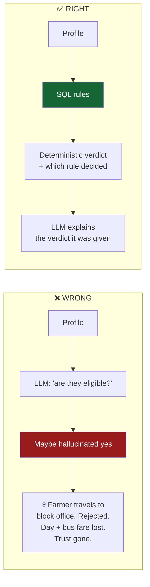

The `/schemes/eligible` response deliberately carries **no `model_version` field** — its absence is
the machine-readable proof that no model was involved (FR-5.2).

---

## 6. Weather Advisory — FR-6

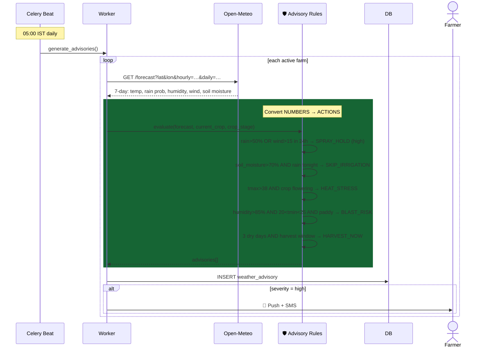

**The design rule (FR-6.2):** never show the farmer "82% humidity". Show them
**"आज दवा न छिड़कें"** — the number is the input, the action is the output.

| Raw data | ❌ What we don't say | ✅ What we say |
|---|---|---|
| rain 82%, wind 18 km/h | "82% वर्षा संभावना" | "आज कीटनाशक न छिड़कें — दवा बह जाएगी" |
| soil moisture 76% | "मिट्टी नमी 76%" | "आज सिंचाई न करें — डीज़ल बचाएं" |
| tmax 38°C, flowering | "अधिकतम तापमान 38°C" | "दोपहर में हल्की सिंचाई करें — फूल झड़ सकते हैं" |

---

## 7. Voice Assistant — FR-7

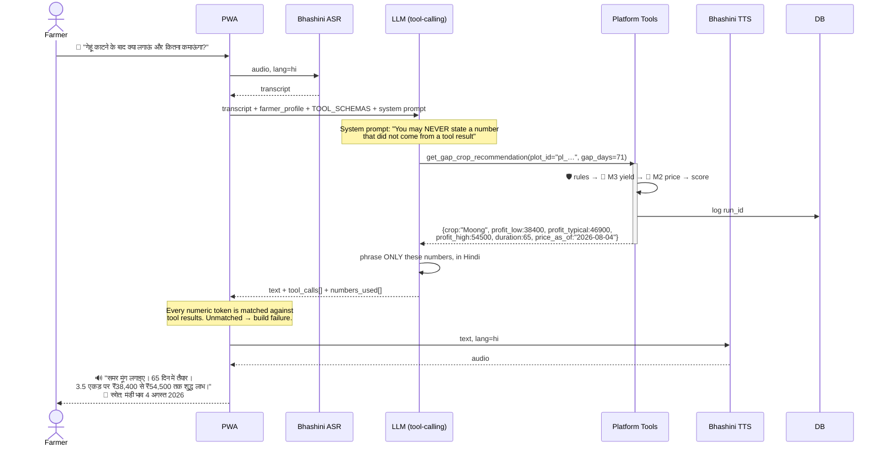

### When no tool can answer

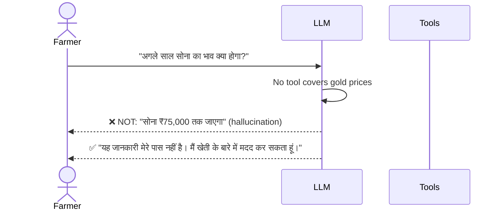

### The enforcement test (blocks the build)

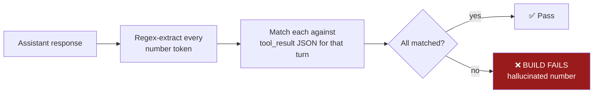

---

## 8. Offline Workflow — FR-8.2

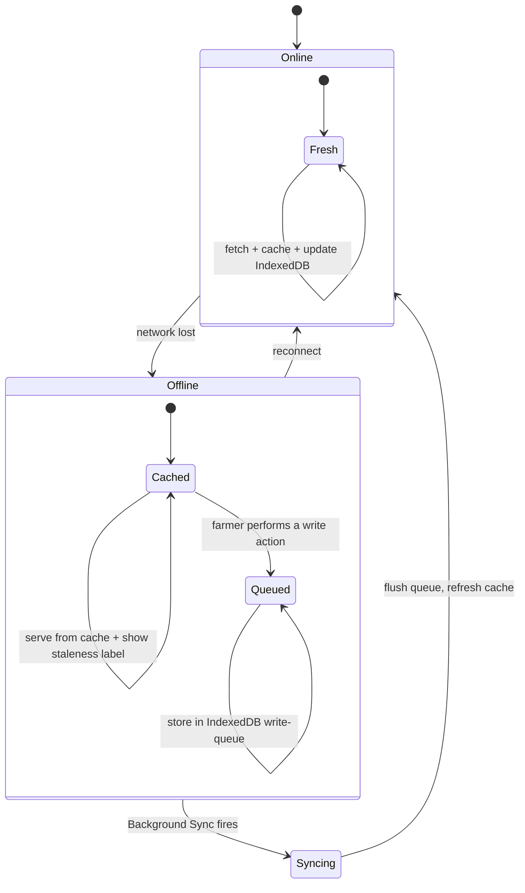

| Capability | Offline? | Notes |
|---|---|---|
| View profile, farms, plots | ✅ | IndexedDB |
| View last gap-crop recommendation | ✅ | Cached with its `data_as_of` shown |
| **Scan leaf for disease** | ✅ | On-device ONNX — full diagnosis + treatment |
| Browse crop / disease / scheme library | ✅ | Reference data, 7-day SWR |
| View last-fetched prices & weather | ⚠️ | Served with a visible "कल का भाव" staleness label |
| Fresh prices, forecast, sell advice | ❌ | Needs network |
| Voice assistant | ❌ | Needs ASR/LLM/TTS |
| Record feedback / harvest data | ✅ queued | Flushed on reconnect |

---

## 9. Error & Degradation Paths — P4

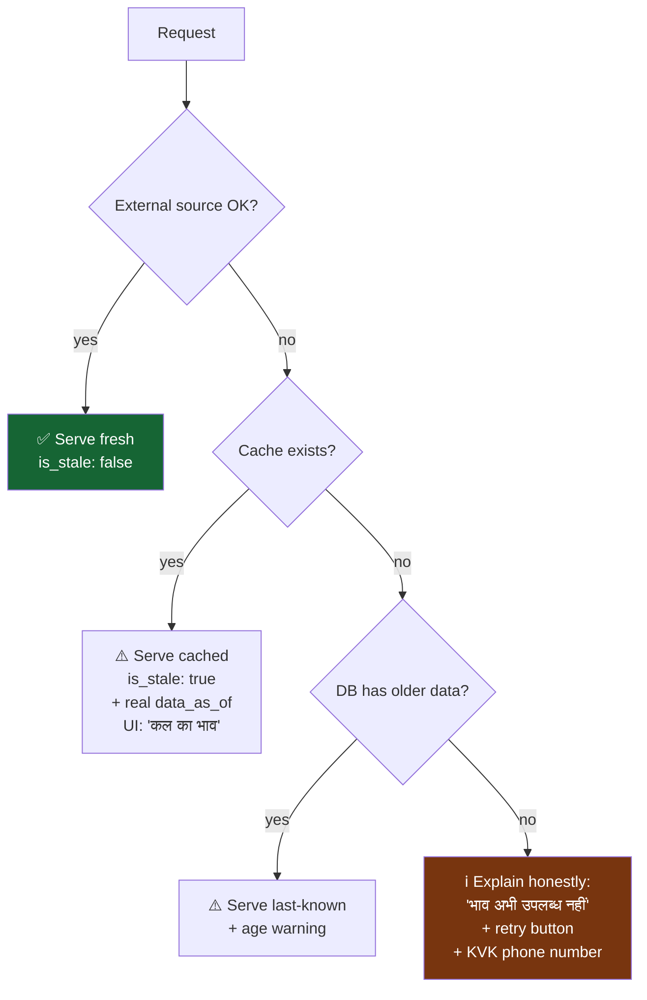

**A blank screen or a raw error code is a bug**, not an acceptable outcome.

| Failure | Behaviour |
|---|---|
| data.gov.in down | Serve `mv_latest_price` with `is_stale: true` |
| Open-Meteo down | Last forecast + "मौसम अपडेट नहीं हुआ" |
| M2 model unloaded | Show current price only; hide forecast section entirely |
| M4 model missing | Offer server inference; if that fails, route to KVK |
| Bhashini down | Text chat still works; TTS falls back to browser `speechSynthesis` |
| LLM down | Direct module UI remains fully usable — assistant is a convenience layer, never the only path |
| DB down | 503 + status page. This is the one real outage. |

---

## 10. Development Workflow

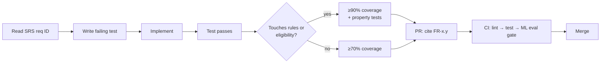

**PR rule:** every PR description names the `FR-x.y` / `NFR-x` it implements. A change that satisfies
no requirement is either scope creep or a missing requirement — both need a conversation before merge.

---

**Next:** [07-UI-UX-DESIGN.md](07-UI-UX-DESIGN.md) — screens and interaction design.
