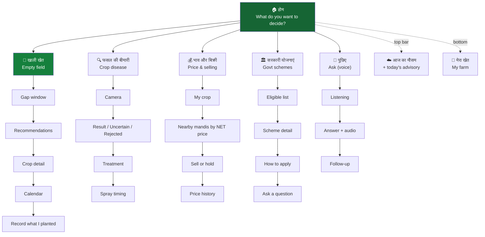
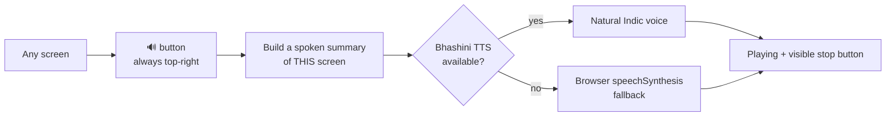

# 07 — UI / UX Design

**Project:** SmartKisan
**Version:** 2.0
**Traces to:** [01-SRS.md](01-SRS.md) NFR-5.x, FR-8.1, FR-8.2

---

## 1. Design Philosophy

### 1.1 Who we are designing for

Ramesh: 42, class-8 education, reads Hindi slowly, **prefers listening**, ₹8,000 Android phone,
3 GB RAM, patchy 4G, uses the phone in bright sunlight with dusty hands.

### 1.2 The five rules

| # | Rule | Consequence |
|---|---|---|
| **1** | **Voice is equal to text, not an add-on** | Every screen has a 🔊 button that reads the whole screen. Every number is spoken. |
| **2** | **One screen, one decision** | No dashboard cramming 7 modules. Home asks: "what do you want to decide today?" |
| **3** | **Show the action, hide the data** | "आज दवा न छिड़कें" — not "82% आर्द्रता". The number is available on tap, never first. |
| **4** | **Numbers are ranges, with their age** | "₹38,000–52,000" and "भाव: 4 अगस्त" — never a bare confident figure. |
| **5** | **Icon + colour + text, always all three** | Colour-blindness, low literacy, and sunlight glare each break one channel alone. |

### 1.3 The current UI's problem

The existing React app is a **dense dark dashboard with English module names**
("Module 1: Gap Crop Recommendation Engine", "XGBoost Optimization Active"). It is designed to
impress a reviewer, not to serve Ramesh.

**Redesign direction:** the technical framing moves to an "Architecture" tab for reviewers.
The farmer-facing app speaks only Hindi/Punjabi/etc., uses big cards, and leads with actions.

---

## 2. Information Architecture



**Five destinations, not nine modules.** Weather is not a destination — it is a persistent strip,
because weather is never the farmer's goal, only context for a decision.

**FR/NFR-5.1 check:** every core answer is ≤3 taps from home.

---

## 3. Key Screens

### 3.1 Home

```
┌─────────────────────────────────────┐
│ 🌾 SmartKisan          हिंदी ▾  👤  │
├─────────────────────────────────────┤
│ ⚠️  आज दवा न छिड़कें                │  ← today's advisory, tappable
│     शाम को बारिश आ रही है      🔊  │     ACTION not data
├─────────────────────────────────────┤
│                                     │
│  आज क्या फैसला लेना है?        🔊  │  ← "What do you want to decide?"
│                                     │
│  ┌───────────────────────────────┐  │
│  │ 🌱  खेत खाली है              │  │  ← 96dp tall, huge target
│  │     71 दिन — क्या लगाऊं?     │  │     contextual: knows the gap
│  │                          ›   │  │
│  └───────────────────────────────┘  │
│  ┌───────────────────────────────┐  │
│  │ 🔍  पत्ती पर धब्बे हैं       │  │
│  │     फोटो खींचकर पहचानें  ›   │  │
│  └───────────────────────────────┘  │
│  ┌───────────────────────────────┐  │
│  │ 💰  फसल बेचनी है             │  │
│  │     टमाटर ₹4,500/क्विं.  ›   │  │  ← live number, their crop
│  └───────────────────────────────┘  │
│  ┌───────────────────────────────┐  │
│  │ 🏛️  सरकारी मदद               │  │
│  │     4 योजनाएं आपके लिए   ›   │  │  ← pre-computed count
│  └───────────────────────────────┘  │
│                                     │
├─────────────────────────────────────┤
│         ╭───────────╮               │
│         │  🎤 पूछिए │               │  ← FAB, always reachable
│         ╰───────────╯               │
└─────────────────────────────────────┘
```

**Design decisions:**
- Cards carry **live, personal data** ("71 दिन", "₹4,500", "4 योजनाएं") — the app already knows, so it shows
- The advisory strip is an **action**, never a weather reading (Rule 3)
- Voice FAB floats over everything — the primary input for our persona
- No English, no "Module 1", no "XGBoost"

---

### 3.2 Gap Crop — the flagship result screen

```
┌─────────────────────────────────────┐
│ ‹  खाली खेत में क्या लगाएं      🔊  │
├─────────────────────────────────────┤
│  15 अप्रैल ── 71 दिन ── 25 जून      │
│  ├──────────────────────────┤       │  ← visual gap bar
│  आपका खेत इतने दिन खाली है           │
├─────────────────────────────────────┤
│ ┌─────────────────────────────────┐ │
│ │ 🥇 सबसे अच्छा विकल्प            │ │
│ │                                 │ │
│ │  समर मूंग                   🔊 │ │
│ │  65 दिन में तैयार               │ │
│ │                                 │ │
│ │  ┌───────────────────────────┐  │ │
│ │  │ अनुमानित शुद्ध लाभ        │  │ │
│ │  │                           │  │ │
│ │  │  ₹38,400 – ₹54,500        │  │ │  ← RANGE, big, green
│ │  │  (सामान्यतः ₹46,900)      │  │ │
│ │  │                           │  │ │
│ │  │  1.25 एकड़ पर             │  │ │
│ │  └───────────────────────────┘  │ │
│ │                                 │ │
│ │  क्यों?                         │ │
│ │  ✓ 65 दिन — आपकी अवधि में फिट   │ │
│ │  ✓ जलोढ़ मिट्टी के लिए उपयुक्त   │ │
│ │  ✓ मिट्टी में नाइट्रोजन जोड़ेगी  │ │
│ │  ✓ अगली धान में यूरिया बचेगी    │ │
│ │                                 │ │
│ │  ⚠️ ध्यान दें                    │ │
│ │  जून में भारी बारिश से फली       │ │  ← risk shown, not buried
│ │  सड़ सकती है                     │ │
│ │                                 │ │
│ │  लागत ₹8,125 · जोखिम कम         │ │
│ │  भाव ₹8,050–8,790/क्विंटल       │ │
│ │  स्रोत: मंडी भाव, 4 अगस्त  ⓘ    │ │  ← provenance always
│ │                                 │ │
│ │  ┌─────────────┐ ┌────────────┐ │ │
│ │  │ पूरी जानकारी│ │ यह लगाऊंगा │ │ │
│ │  └─────────────┘ └────────────┘ │ │
│ └─────────────────────────────────┘ │
│                                     │
│ ┌─────────────────────────────────┐ │
│ │ 2️⃣ उड़द   ₹28,000–39,000     › │ │
│ └─────────────────────────────────┘ │
│ ┌─────────────────────────────────┐ │
│ │ 3️⃣ ढैंचा (हरी खाद) ₹0 – मिट्टी › │ │
│ └─────────────────────────────────┘ │
│                                     │
│  ▸ ये फसलें क्यों नहीं? (6)         │  ← FR-2.8 transparency
└─────────────────────────────────────┘
```

**Why this layout works:**

| Element | Purpose |
|---|---|
| Gap bar at top | Farmer instantly confirms we understood their situation |
| Profit as a **range** in the largest type | The one number they came for — honest about uncertainty (Rule 4) |
| "क्यों?" checklist | Trust. They can verify our reasoning against their own knowledge |
| **⚠️ risk shown on the card** | Not hidden in a detail page. Builds credibility rather than eroding it |
| Source + date | "मंडी भाव, 4 अगस्त" — they know how fresh this is |
| "यह लगाऊंगा" button | Starts the feedback loop (FR-2.12) — the most valuable data we can collect |
| "ये फसलें क्यों नहीं?" | Transparency; also educational |

---

### 3.3 Disease scan — the three outcomes

All three are **successful** results. The UI treats them as equals, not as success/failure.

```
┌──────────────────┐  ┌──────────────────┐  ┌──────────────────┐
│  ✅ CONFIDENT    │  │  ⚠️ UNCERTAIN    │  │  ❌ NOT A LEAF   │
├──────────────────┤  ├──────────────────┤  ├──────────────────┤
│ [leaf + heatmap] │  │ [leaf photo]     │  │ [photo]          │
│                  │  │                  │  │                  │
│ अगेती झुलसा      │  │ निश्चित पहचान    │  │ यह पत्ती की      │
│ भरोसा: 87%       │  │ नहीं हो पाई      │  │ तस्वीर नहीं लगती │
│                  │  │                  │  │                  │
│ 🌿 जैविक इलाज    │  │ हो सकता है:      │  │ ऐसे फोटो लें:    │
│ ट्राइकोडर्मा     │  │ • अगेती झुलसा 52%│  │ ✓ पत्ती सामने    │
│ 5 ग्राम/लीटर     │  │ • सेप्टोरिया 31% │  │ ✓ अच्छी रोशनी    │
│                  │  │                  │  │ ✓ पास से         │
│ 🧪 रासायनिक      │  │ 📞 KVK करनाल     │  │                  │
│ मैंकोज़ेब 2.5g/L │  │    18 किमी दूर   │  │ [फिर से फोटो]    │
│ 7 दिन तक फल      │  │    कॉल करें      │  │                  │
│ न तोड़ें          │  │                  │  │                  │
│                  │  │ [फिर से फोटो]    │  │                  │
│ 🚫 आज न छिड़कें  │  │                  │  │                  │
│ बारिश आ रही है   │  │                  │  │                  │
│ ✅ 6 अगस्त सुबह  │  │                  │  │                  │
│                  │  │                  │  │                  │
│ 📄 ICAR 2023     │  │                  │  │                  │
│ ⚠️ KVK से पुष्टि │  │                  │  │                  │
└──────────────────┘  └──────────────────┘  └──────────────────┘
```

**Key UX decisions:**
- **Organic listed first**, always — cheaper, safer, often sufficient
- **PHI stated in plain language**: "7 दिन तक फल न तोड़ें", not "PHI: 7 days"
- **Spray timing is part of the diagnosis**, not a separate screen — the advice is incomplete without it
- **Uncertain gives a real phone number**, not a dead end
- **Grad-CAM heatmap** lets the farmer see if the model looked at the lesion or at their thumb
- Citation and disclaimer are permanent, not dismissible

---

### 3.4 Mandi — sorted by NET, not headline price

```
┌─────────────────────────────────────┐
│ ‹  टमाटर बेचना है — 20 क्विंटल  🔊  │
├─────────────────────────────────────┤
│ ┌─────────────────────────────────┐ │
│ │ 🥇 करनाल मंडी      12 किमी      │ │
│ │                                 │ │
│ │ भाव      ₹4,500/क्विंटल         │ │
│ │ कुल      ₹90,000                │ │
│ │ ढुलाई   −₹1,240                 │ │
│ │ फीस     −₹1,500                 │ │
│ │ ─────────────────────           │ │
│ │ आपको मिलेगा  ₹87,260        ✓  │ │  ← NET, emphasised
│ └─────────────────────────────────┘ │
│ ┌─────────────────────────────────┐ │
│ │ 2️⃣ आज़ादपुर, दिल्ली  128 किमी   │ │
│ │ भाव ₹4,900 (₹400 ज़्यादा!)      │ │
│ │ ढुलाई −₹12,800                  │ │
│ │ आपको मिलेगा  ₹83,320            │ │
│ └─────────────────────────────────┘ │
│                                     │
│ 💡 दिल्ली में भाव ₹400 ज़्यादा है,   │
│    लेकिन ढुलाई के बाद ₹3,940       │  ← the insight, in words
│    कम मिलेगा।                       │
├─────────────────────────────────────┤
│ 🔴 आज ही बेचें                      │
│ टमाटर जल्दी खराब होता है और भाव     │
│ गिरने का अनुमान है                   │
│ 30 दिन बाद: ₹68,200–90,600 (अनिश्चित)│
└─────────────────────────────────────┘
```

> This screen is the clearest expression of the product's value. AGMARKNET shows ₹4,900 for Delhi.
> We show that ₹4,900 is **₹3,940 worse** after transport. The cost breakdown is visible so the
> farmer can verify our arithmetic against their own experience.

---

### 3.5 Voice assistant

```
┌─────────────────────────────────────┐
│ ‹  पूछिए                    हिंदी ▾ │
├─────────────────────────────────────┤
│                        ┌──────────┐ │
│                        │ गेहूं के │ │
│                        │ बाद क्या │ │
│                        │ लगाऊं?   │ │
│                        └──────────┘ │
│ ┌────────────────────────────────┐  │
│ │ 🌾 समर मूंग लगाइए।             │  │
│ │                                │  │
│ │ 65 दिन में तैयार हो जाएगी।     │  │
│ │ आपके 1.25 एकड़ पर ₹38,400 से   │  │
│ │ ₹54,500 तक शुद्ध लाभ हो सकता   │  │
│ │ है।                            │  │
│ │                                │  │
│ │ 📄 स्रोत: मंडी भाव 4 अगस्त      │  │  ← provenance shown
│ │                            🔊  │  │
│ └────────────────────────────────┘  │
│                                     │
│ सुझाव:                              │
│ [ बीज कहां मिलेगा? ]                │
│ [ कितना पानी चाहिए? ]               │
│ [ भाव कब बढ़ेगा? ]                  │
├─────────────────────────────────────┤
│  ┌───────────────────────────────┐  │
│  │        🎤  बोलिए              │  │  ← hold to talk
│  └───────────────────────────────┘  │
│         या ⌨️ टाइप करें              │
└─────────────────────────────────────┘
```

Every answer carries its source line. When the assistant cannot answer, it says so and offers the
KVK number rather than guessing.

---

## 4. Visual Design System

### 4.1 Colour

Chosen for **sunlight readability** and colour-blind safety. Contrast ratios meet WCAG AA (NFR-5.3).

| Token | Hex | Use | Contrast on white |
|---|---|---|---|
| `--green-700` | `#15803d` | Primary action, positive | 4.9:1 ✓ |
| `--green-50` | `#f0fdf4` | Success background | — |
| `--amber-600` | `#d97706` | Caution, medium risk | 4.6:1 ✓ |
| `--red-700` | `#b91c1c` | Danger, do-not-spray, high risk | 6.1:1 ✓ |
| `--slate-900` | `#0f172a` | Primary text | 17.9:1 ✓ |
| `--slate-600` | `#475569` | Secondary text | 7.6:1 ✓ |
| `--white` | `#ffffff` | Surface | — |

> **Light theme, not dark.** The current app is dark-themed, which looks premium on a desktop and is
> nearly unreadable on a cheap LCD in direct sunlight. Farmers work outdoors. This is a real
> usability decision, not a taste preference.

**Never colour alone (Rule 5):**

| Meaning | Colour | Icon | Text |
|---|---|---|---|
| Do not spray | red | 🚫 | "आज न छिड़कें" |
| Safe to spray | green | ✅ | "छिड़क सकते हैं" |
| Caution | amber | ⚠️ | "ध्यान दें" |

### 4.2 Typography

| Role | Size | Weight | Notes |
|---|---|---|---|
| Screen title | 24 px | 700 | |
| Big number (profit, price) | 32 px | 800 | The hero element |
| Card title | 20 px | 600 | |
| Body | 17 px | 400 | **≥16 px minimum** (NFR-5.2) |
| Caption / source | 14 px | 400 | Never below 14 px |

**Font:** Noto Sans Devanagari / Gurmukhi / Bengali — full Indic coverage, self-hosted with
`font-display: swap`, subset per language to keep the bundle under 500 KB (NFR-1.6).

**Numbers use Indian grouping:** ₹46,900 (lakh/crore system), never ₹46,900.00 or 46.9K.

### 4.3 Touch targets & spacing

| Element | Size |
|---|---|
| Minimum touch target | **48×48 dp** (NFR-5.2) |
| Primary decision card | 96 dp tall |
| Primary button | 56 dp tall, full width |
| Voice FAB | 64 dp |
| Gap between tappables | ≥8 dp |

Designed for **one-handed use on a 5-inch screen** with dusty or wet fingers — primary actions sit
in the lower half, within thumb reach.

---

## 5. Voice & Audio (NFR-5.4)



**Rules:**
- Every screen is fully consumable by listening alone
- Numbers are spoken naturally: "अड़तीस हज़ार चार सौ" — not digit-by-digit
- Playback is interruptible (barge-in, FR-7.7)
- Audio state persists across navigation so a farmer can listen while scrolling

---

## 6. Offline UX (FR-8.2)

```
┌─────────────────────────────────────┐
│ 📴 इंटरनेट नहीं है                  │  ← persistent, non-alarming
├─────────────────────────────────────┤
│ ✅ आप ये कर सकते हैं:               │
│  • पत्ती की बीमारी पहचानें          │  ← works fully offline
│  • पिछली सलाह देखें                 │
│  • फसल की जानकारी पढ़ें             │
│                                     │
│ ⏳ इंटरनेट आने पर मिलेगा:           │
│  • आज का ताज़ा भाव                  │
│  • आवाज़ से पूछना                    │
└─────────────────────────────────────┘
```

**Staleness is labelled, never hidden:**

```
┌───────────────────────────────┐
│ टमाटर  ₹4,500/क्विंटल         │
│ ⏱️ कल का भाव (3 अगस्त)   ⟳    │  ← honest age + retry
└───────────────────────────────┘
```

The offline banner leads with **what still works**, not with what is broken.

---

## 7. Localisation (FR-8.1)

| Language | Code | Script | Priority |
|---|---|---|---|
| Hindi | `hi` | Devanagari | P0 |
| Punjabi | `pa` | Gurmukhi | P0 |
| Marathi | `mr` | Devanagari | P0 |
| Bengali | `bn` | Bengali | P1 |
| Bhojpuri | `bho` | Devanagari | P1 |
| English | `en` | Latin | P1 (reviewers, admins) |

**Implementation notes:**
- `i18next` with per-language JSON bundles, lazy-loaded — no unused scripts in the initial payload
- **Never concatenate strings.** `"{{crop}} में {{days}} दिन लगेंगे"` — Indic word order differs from English
- Indic plural rules and gendered verb forms handled by ICU message format
- Crop, disease, and scheme names come from the DB `names` JSONB column, not from UI translation files —
  agronomic terminology needs expert review, not a translator's guess
- Numbers, dates, and currency formatted per locale (`Intl.NumberFormat('hi-IN')`)

---

## 8. Migration from the Current UI

The existing React app has real value — component structure, land-unit converter, routing. Here is
what happens to each piece.

| Current component | Action |
|---|---|
| `App.jsx` | **Restructure** — replace 9-tab nav with the 5-decision home |
| `Navbar.jsx` | **Simplify** — language switcher + profile only |
| `DashboardOverview.jsx` | **Replace** with the decision-card home |
| `GapCropEngine.jsx` | **Rewrite UI**, wire to `POST /recommendations/gap-crop` |
| `MandiPriceSearch.jsx` | **Rewrite** around `/mandi/nearby` net-realisation view |
| `DiseaseDetector.jsx` | **Rewrite** with 3 outcome states + on-device ONNX |
| `SchemeFinder.jsx` | **Rewrite** with eligible/not-eligible + reasons |
| `WeatherAdvisory.jsx` | **Demote** to the home advisory strip + detail page |
| `VoiceAssistant.jsx` | **Rewrite** — real ASR/TTS, tool-call provenance display |
| `ProfitPredictor.jsx` | **Merge into** Gap Crop — two profit figures for one crop confuses everyone |
| `LandUnitInput.jsx` | **Keep and extend** ✅ — genuinely good; add state-aware factors |
| `FarmerProfileSetup.jsx` | **Refactor** into the guided onboarding flow |
| `SystemArchitecture.jsx` | **Move** to `/about/architecture` — for reviewers, not farmers |
| `mockData.js` | **Delete progressively**, one module at a time, as each goes live |
| `landConverter.js` | **Keep, extend** ✅ — move factors to DB, add bigha-by-state |

**Migration rule:** delete each block of mock data in the same PR that connects its real endpoint.
Never let mock and real data coexist in a shipped build — that is how fake numbers reach users.

---

## 9. Accessibility Checklist (NFR-5.x)

- [ ] All interactive elements ≥48×48 dp
- [ ] Body text ≥16 px; no text below 14 px anywhere
- [ ] Contrast ≥4.5:1 for text, ≥3:1 for UI components
- [ ] Meaning never carried by colour alone
- [ ] Every screen has working 🔊 audio playback
- [ ] All images have alt text in the active language
- [ ] Focus order is logical; visible focus ring
- [ ] Forms have labels, not just placeholders
- [ ] Errors are announced to screen readers (`aria-live`)
- [ ] Works at 200% browser zoom without horizontal scroll
- [ ] Usable one-handed on a 5-inch screen
- [ ] Tested on a real 3 GB RAM Android device in direct sunlight

---

## 10. Performance Budget (NFR-1.5, 1.6, 1.7)

| Metric | Budget |
|---|---|
| Initial JS (gzipped) | < 200 KB |
| Initial CSS | < 30 KB |
| Fonts (one language subset) | < 120 KB |
| **Total first load** | **< 500 KB** |
| First Contentful Paint (3G) | < 3 s |
| Time to Interactive (3G) | < 5 s |
| On-device model (lazy, cached) | ~6 MB, one-time |

**Techniques:** route-level code splitting, per-language font subsetting, WebP images with
`loading="lazy"`, ONNX model fetched only on first disease scan, Workbox precache for the app shell.

---

**Next:** [08-PROJECT-PLAN.md](08-PROJECT-PLAN.md) — phases, milestones, and risks.
