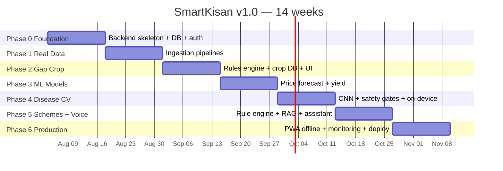
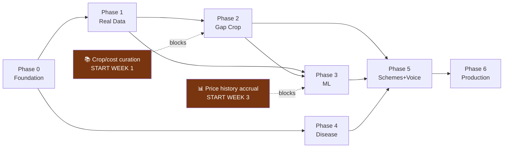

# 08 — Project Plan

**Project:** SmartKisan
**Version:** 2.0
**Start:** 2026-08-04 · **Target v1.0:** ~14 weeks (part-time, single developer)

---

## 1. Current State (baseline audit, 2026-08-04)

### What exists

| Item | Detail |
|---|---|
| Frontend | React 18 + Vite, ~3,900 lines, 13 components |
| Modules with UI | All 9 — dashboard, gap crop, mandi, profit, voice, schemes, weather, disease, architecture |
| Genuinely good | `LandUnitInput.jsx`, `landConverter.js`, component structure, information architecture |
| Backend | **None** |
| Database | **None** |
| ML models | **None** |
| API calls | **Zero `fetch()` in `src/`** |

### The gap

| Module | Current implementation | Reality |
|---|---|---|
| Gap crop | `crops.filter(c => c.duration <= gapDays + 10)` | Soil, irrigation, previous-crop inputs are **read but never used** |
| Profit predictor | `× 1.05` for "XGBoost", `× 0.98` for "Random Forest" | That is the entire "model" |
| Disease | `setTimeout(2000)` → pre-selected disease | Uploaded image is never read |
| Voice | `if (query.includes('गेहूं'))` → canned string | 4 branches total |
| Mandi | 15 hardcoded rows, `date: "Today"` | Permanently "today" |
| Schemes | `matchScore: 98` hardcoded | Not computed from any profile |

**Assessment:** an excellent UI prototype with zero working logic. Every displayed number is
fabricated. The README claims EfficientNet-B4, XGBoost, Bhashini, PostGIS, and Kubernetes — none of
which exist in the repository.

**This plan's single organising goal:** make every number on screen traceable to a real source.

---

## 2. Phases

---

### Phase 0 — Foundation (Weeks 1–2)

**Goal:** a running backend the frontend can talk to.

| # | Task | Requirement |
|---|---|---|
| 0.1 | Restructure repo into `apps/web`, `apps/api`, `ml/`, `infra/` | — |
| 0.2 | FastAPI skeleton: config, logging, error envelope, `/health` | NFR-3.2 |
| 0.3 | Docker Compose: api, postgres+postgis+pgvector, redis, minio | — |
| 0.4 | Alembic + core schema: farmer, farm, plot, crop, mandi | 03-DATA-DESIGN |
| 0.5 | OTP auth + JWT + refresh rotation | FR-1.1, NFR-4.2 |
| 0.6 | Profile/farm/plot CRUD with ownership checks | FR-1.2–1.4 |
| 0.7 | **State-aware land conversion** in DB + exhaustive unit tests | FR-1.5 |
| 0.8 | Nominatim geocoding client with caching | FR-1.3 |
| 0.9 | Frontend: move to `apps/web`, add API client, TanStack Query, auth flow | — |
| 0.10 | CI: lint, typecheck, test, build | NFR-7.1 |

**Exit criteria**
- [ ] `docker compose up` brings the full stack up
- [ ] Farmer can register with OTP and create a farm + plot from the real UI
- [ ] "5 बीघा" in Haryana correctly stores 1.25 acres, and the UI echoes the conversion
- [ ] `/health/deep` reports DB, Redis, and migration status
- [ ] CI green

---

### Phase 1 — Real Data (Weeks 3–4)

**Goal:** delete the first mock data. Real prices and weather flowing.

| # | Task | Requirement |
|---|---|---|
| 1.1 | AGMARKNET client: pagination, `DD/MM/YYYY` parsing, retry/backoff | C-4 |
| 1.2 | Mandi name → `mandi_id` resolution + geocoding of new mandis | §6 Data Design |
| 1.3 | Commodity alias normalisation table (`"Bottle gourd"`/`"Lauki"` → one crop) | §6 |
| 1.4 | Data-quality gates at ingest (price sanity, outliers, date range) | §6 |
| 1.5 | Celery beat nightly ingest 02:00 IST + `mv_latest_price` refresh | §6.1 Workflows |
| 1.6 | **Historical backfill** — iterate dates backwards, rate-limited | ADR-5 |
| 1.7 | Open-Meteo forecast + archive clients, Redis-cached | FR-6.1 |
| 1.8 | Weather advisory rule engine (spray hold, irrigation, heat, disease risk) | FR-6.2, 6.3 |
| 1.9 | `GET /mandi/prices`, `/nearby` (PostGIS + net realisation), `/prices/history` | FR-3.1, 3.2, 3.7 |
| 1.10 | **Rewire `MandiPriceSearch.jsx` and `WeatherAdvisory.jsx` to real endpoints** | — |
| 1.11 | **Delete mandi + weather blocks from `mockData.js`** | Acceptance #1 |
| 1.12 | Staleness UI: `is_stale` banner, `data_as_of` label | FR-3.9, P4 |

**Exit criteria**
- [ ] Nightly job ingests ~17,000 rows in <15 min, idempotent on re-run
- [ ] ≥90 days of price history in the DB
- [ ] Nearby-mandi view sorts by **net realisation**, not headline price
- [ ] Weather advisories are actions, not numbers
- [ ] Turning off the network shows cached data with a visible age label — never a blank screen

---

### Phase 2 — Gap Crop Engine (Weeks 5–6) 🚩 **flagship**

**Goal:** the module that justifies the project.

| # | Task | Requirement |
|---|---|---|
| 2.1 | Curate **≥20 Zaid crops** with agronomic parameters + citations | FR-2.9 |
| 2.2 | Curate cost-of-cultivation norms and yield ranges per state | §4.3 Data Design |
| 2.3 | Hard constraint filter — pure functions, ≥90% coverage | FR-2.2, 2.3 |
| 2.4 | Scoring function with configurable weights | FR-2.4 |
| 2.5 | Risk index (price volatility, weather, pest, market depth) | §2.3 ML Design |
| 2.6 | SHAP-based explanation generation → Hindi templates | FR-2.7 |
| 2.7 | Excluded-crops output with reasons | FR-2.8 |
| 2.8 | `POST /recommendations/gap-crop` + audit persistence | FR-2.11 |
| 2.9 | Crop calendar generation | FR-2.10 |
| 2.10 | Feedback endpoints → `cropping_history` | FR-2.12 |
| 2.11 | Rebuild `GapCropEngine.jsx` per the design in 07-UI-UX | §3.2 UI Design |
| 2.12 | **Merge `ProfitPredictor` into Gap Crop; delete the duplicate** | §8 UI Design |
| 2.13 | **Expert review:** KVK agronomist reviews 50 recommendations | §2.5 ML Design |

**Exit criteria**
- [ ] ≥20 crops, each with a cited source
- [ ] Property tests: an excluded crop **never** appears in output, across thousands of random inputs
- [ ] Profit shown as a range with the risk visible on the card
- [ ] Explanations render correctly in Hindi
- [ ] Agronomist rates ≥90% of sampled recommendations "sound"
- [ ] `mockData.js` gap-crop block deleted

---

### Phase 3 — ML Models (Weeks 7–8)

**Goal:** real predictions replacing constants.

| # | Task | Requirement |
|---|---|---|
| 3.1 | MLflow + DVC setup | NFR-6.1 |
| 3.2 | Feature pipeline for price forecasting (lags, rolling, seasonal, spatial, weather, MSP) | §3.3 ML Design |
| 3.3 | **Baselines first** — naive, seasonal-naive, rolling mean | NFR-6.3 |
| 3.4 | LightGBM quantile models, h ∈ {7,30,60,90} | §3.4 |
| 3.5 | **Walk-forward backtest** (never a random split) | §3.5 |
| 3.6 | Interval-coverage validation | §3.5 |
| 3.7 | Yield model on District APY + ERA5 weather | §4 |
| 3.8 | Transparent farm-level adjustment multipliers | §4.3 |
| 3.9 | Wire M2 + M3 into the gap-crop engine | FR-2.5 |
| 3.10 | `GET /mandi/forecast` with `model_quality` in the response | FR-3.5 |
| 3.11 | Sell/hold advisory with spoilage and storage cost | FR-3.6 |
| 3.12 | **Hide forecasts for any commodity failing to beat baseline** | NFR-6.3 |
| 3.13 | CI eval gate: block deploy if the new model loses | NFR-6.2 |

**Exit criteria**
- [ ] Published per-commodity MAPE vs seasonal-naive
- [ ] 80% intervals achieve 75–85% empirical coverage
- [ ] Commodities failing the baseline show **no forecast** in the UI
- [ ] Gap-crop profit figures now derive from M2 + M3, not constants
- [ ] `ML_MODEL_COMPARISON` fake metrics deleted from `mockData.js`

---

### Phase 4 — Disease Detection (Weeks 9–10)

**Goal:** the highest-liability module, built safely.

| # | Task | Requirement |
|---|---|---|
| 4.1 | Acquire + version PlantVillage and PlantDoc | §5.1 ML Design |
| 4.2 | Train EfficientNet-B0 on PlantVillage | §5.2 |
| 4.3 | **Fine-tune on PlantDoc; report PlantDoc accuracy as headline** | §5.1 |
| 4.4 | Field-realistic augmentation (shadow, blur, JPEG, brightness) | §5.2 |
| 4.5 | OOD rejection via energy score + negative validation set | FR-4.4 |
| 4.6 | Temperature scaling; measure ECE | FR-4.6, NFR-6.4 |
| 4.7 | Abstention threshold + KVK routing (PostGIS nearest) | FR-4.5 |
| 4.8 | Grad-CAM generation | FR-4.7 |
| 4.9 | **Curate cited treatment table** (ICAR/CIB&RC), DB citation constraint | FR-4.9 |
| 4.10 | Weather-gated spray advisory | FR-4.10 |
| 4.11 | ONNX → TFLite int8 export, <8 MB | NFR-1.7 |
| 4.12 | On-device inference in the PWA (`onnxruntime-web`) | FR-4.2 |
| 4.13 | Rebuild `DiseaseDetector.jsx` with 3 outcome states | §3.3 UI Design |

**Exit criteria**
- [ ] **PlantDoc** test accuracy ≥70% reported (not the PlantVillage number)
- [ ] ≥95% of non-leaf images rejected
- [ ] ECE < 0.05
- [ ] False-healthy rate < 5%
- [ ] Every chemical entry has a citation — enforced by DB constraint
- [ ] Works fully offline after first model download
- [ ] `PLANT_DISEASES_DB` mock deleted

---

### Phase 5 — Schemes & Voice (Weeks 11–12)

| # | Task | Requirement |
|---|---|---|
| 5.1 | Curate ≥25 schemes with structured eligibility rules | FR-5.5 |
| 5.2 | Deterministic rule engine + `passed`/`failed` reasons | FR-5.1, 5.4 |
| 5.3 | Ingest official scheme documents → chunk → embed → pgvector | FR-5.6 |
| 5.4 | Scoped RAG (approved schemes only) + mandatory citations | FR-5.2 |
| 5.5 | Rebuild `SchemeFinder.jsx` with eligible / not-eligible reasons | §5 Workflows |
| 5.6 | Bhashini ASR + TTS clients with fallback | FR-7.1, 7.2 |
| 5.7 | Define the 8 assistant tools | §7.2 ML Design |
| 5.8 | LLM tool-calling loop + constrained system prompt | FR-7.3, 7.4 |
| 5.9 | `numbers_used` provenance extraction | FR-7.4 |
| 5.10 | **Adversarial hallucination test suite (build-blocking)** | §7.4 ML Design |
| 5.11 | Rebuild `VoiceAssistant.jsx` with SSE + provenance display | §3.5 UI Design |
| 5.12 | Full i18n: 6 languages, all screens | FR-8.1 |

**Exit criteria**
- [ ] 100% of eligibility decisions are rule-driven; verified against official guidelines
- [ ] Adversarial suite passes — **no unmapped number in any assistant response**
- [ ] Assistant says "I don't know" when no tool applies
- [ ] All screens render correctly in 6 languages
- [ ] `SCHEMES_DATABASE` and `VOICE_SAMPLE_QUERIES` mocks deleted

---

### Phase 6 — Production (Weeks 13–14)

| # | Task | Requirement |
|---|---|---|
| 6.1 | Service worker, Workbox caching tiers, IndexedDB store | FR-8.2 |
| 6.2 | Background Sync write queue | FR-8.3 |
| 6.3 | `GET /sync/bootstrap` | FR-8.2 |
| 6.4 | Offline UI states + staleness labels | §6 UI Design |
| 6.5 | Prometheus + Grafana (technical + business dashboards) | §9 System Design |
| 6.6 | Evidently weekly drift job | NFR-6.5 |
| 6.7 | Sentry, structured logging with correlation IDs | §9 |
| 6.8 | Load test to NFR-2.1 | NFR-2.1 |
| 6.9 | Security review, rate limits, secret scan | NFR-4.x |
| 6.10 | Backup + restore drill | NFR-3.4 |
| 6.11 | **Delete `mockData.js` entirely** | Acceptance #1 |
| 6.12 | Rewrite README to match reality | Acceptance #10 |
| 6.13 | **Field test with 10 real farmers** | Acceptance #9 |
| 6.14 | Deploy to production VM | §10 System Design |

**Exit criteria**
- [ ] All 10 acceptance criteria in [01-SRS §6](01-SRS.md) met
- [ ] `mockData.js` does not exist
- [ ] 10 farmers complete unassisted sessions and can restate the advice they received

---

## 3. Milestones

| M | Week | Milestone | Demonstrable |
|---|---|---|---|
| **M1** | 2 | Backend live | Register, create farm, correct land conversion |
| **M2** | 4 | Real data flowing | Today's actual mandi prices; net-realisation ranking |
| **M3** | 6 | Flagship works | Gap-crop advice with real constraints + explanations |
| **M4** | 8 | ML predictions live | Backtested forecasts beating baseline |
| **M5** | 10 | Disease detection | On-device, offline, with all three safety gates |
| **M6** | 12 | Complete feature set | Schemes + voice in 6 languages |
| **M7** | 14 | **v1.0 released** | Zero mock data; validated with real farmers |

---

## 4. Risk Register

| ID | Risk | Likelihood | Impact | Mitigation | Trigger |
|---|---|---|---|---|---|
| **R1** | data.gov.in API removed or rate-limited | Low | **Critical** | Own the history from day 1 (Phase 1.6); AGMARKNET HTML scraper as fallback; eNAM as alternate | Ingest failures 3 days running |
| **R2** | Price forecast fails to beat baseline | **Medium** | High | Ship only where it wins (3.12); the price *history + net realisation* features stand alone without forecasting | Backtest MAPE ≥ seasonal-naive |
| **R3** | Disease model <70% on PlantDoc | **Medium** | High | Reduce class count to the highest-confidence diseases; raise abstention threshold; lean on KVK routing | PlantDoc eval <70% |
| **R4** | Bhashini free tier insufficient | Medium | Medium | Self-host AI4Bharat IndicWhisper/IndicTTS; text-only fallback always available | Rate limit hit in pilot |
| **R5** | Crop/cost data curation takes far longer than planned | **High** | Medium | Start Phase 2 curation during Phase 0; launch with 12 crops if needed and add incrementally | Week 5 with <15 crops ready |
| **R6** | Solo developer capacity / burnout | **High** | High | Phases are independently shippable; P1/P2 requirements are droppable; no phase blocks the previous one's value | Two consecutive phases slipping |
| **R7** | Farmers do not trust or adopt the advice | Medium | **Critical** | Explanations, ranges, KVK routing, expert review, field test in Phase 6 | Field test feedback |
| **R8** | Wrong agronomic advice causes real crop loss | Low | **Critical** | Hard rules, expert review, ranges, disclaimers, audit log, cited dosages | Any incident → immediate halt + review |
| **R9** | Land unit conversion error corrupts all economics | Medium | **Critical** | State-aware DB table, exhaustive unit tests, UI echo-and-confirm | Any conversion test failure |
| **R10** | Open-Meteo changes licensing | Low | Medium | ERA5 via Copernicus directly; IMD paid tier as last resort | Terms change notice |

### Highest-priority risks

**R7 (adoption)** is the one that decides whether this project matters. Every design choice —
explanations, ranges, refusing to answer, KVK routing — exists to earn trust. Technical excellence
with zero adoption is a failed project.

**R8 / R9 (harm)** are the ones with no acceptable failure rate. They are why the rules layer exists
and why conversion factors get exhaustive tests.

**R5 (curation)** is the most likely to actually slip the schedule. Curating 20 crops with cited
agronomic parameters and per-state cost norms is genuinely slow, unglamorous work — and it cannot be
generated by an LLM without destroying the project's credibility. **Start it in Week 1.**

---

## 5. Dependencies

**Two long-lead items must start early:**

1. **Crop curation** (blocks Phase 2) — begin Week 1, in parallel with backend work
2. **Price history** (blocks Phase 3) — every day of delay is a day of training data lost.
   Start ingestion the moment Phase 1 begins, and run the backfill immediately.

**Phase 4 (Disease) is deliberately independent** of Phases 2–3 — it only needs Phase 0. If ML work
slips, disease detection can proceed in parallel.

---

## 6. Definition of Done

**Per task**
- [ ] Implements a named requirement (`FR-x.y` / `NFR-x`) cited in the PR
- [ ] Tests written and passing; coverage target met for its layer
- [ ] No mock data introduced or left behind
- [ ] Errors degrade gracefully (P4)
- [ ] User-facing strings localised
- [ ] API changes reflected in OpenAPI

**Per phase**
- [ ] All exit criteria met
- [ ] Corresponding `mockData.js` block deleted
- [ ] Demo recorded
- [ ] Docs updated where design changed
- [ ] Deployed to staging

**Per model**
- [ ] Beats naive baseline
- [ ] Beats incumbent on frozen holdout
- [ ] Calibration verified
- [ ] Registered in MLflow with data hash + metrics
- [ ] Shadow-run ≥7 days before serving
- [ ] Slice metrics checked (state, land size, irrigation type)

---

## 7. What Is Deliberately Deferred

| Deferred | Why | Revisit when |
|---|---|---|
| Kubernetes | One VM meets NFR-2.1 comfortably | >50k DAU |
| Microservices | Solo developer; boundaries already drawn for later extraction | Team >4 |
| Satellite NDVI | Large effort; marginal gain over ground data at this stage | After v1 adoption |
| IVR / SMS channel (FR-8.4) | High value but a separate integration track | v1.1 |
| Native mobile app | PWA covers the need without store friction | Play Store distribution becomes necessary |
| Marketplace / input selling | Out of scope; changes the product's incentives | Never, without careful thought |
| Farm-level yield model | Needs `cropping_history` data we don't have yet | ≥1,000 recorded outcomes |

---

## 8. Success Metrics

### Technical (measured at v1.0)

| Metric | Target |
|---|---|
| Mock data remaining | **0 lines** |
| Ingestion success rate | ≥98% of nights |
| API p95 latency | <300 ms cached / <1.5 s computed |
| Price forecast MAPE vs baseline | Beats seasonal-naive on ≥10 commodities |
| Disease PlantDoc accuracy | ≥70% |
| Assistant hallucinated numbers | **0** |
| Test coverage | ≥70% overall, ≥90% rules |

### Product (measured post-launch)

| Metric | Why it matters |
|---|---|
| **Recommendations → actually planted** | The only proof the advice was useful |
| Predicted vs actual yield error | Are we right? |
| **₹ earned on previously-fallow land** | The real mission metric |
| Return-visit rate | Trust |
| Voice usage share | Are we serving the low-literacy user we designed for? |
| Disease scans → KVK routed | Is the abstention path working? |

> The last technical metric — **zero hallucinated numbers** — and the third product metric —
> **₹ earned on previously-fallow land** — are the two that this entire project stands or falls on.

---

**Next:** [09-TESTING-STRATEGY.md](09-TESTING-STRATEGY.md)
